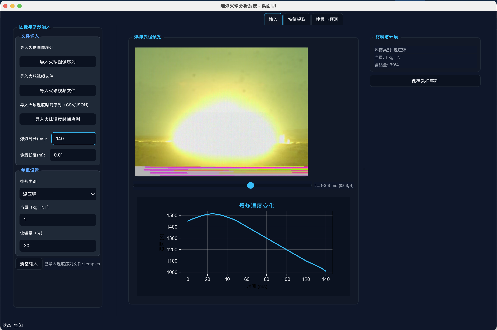
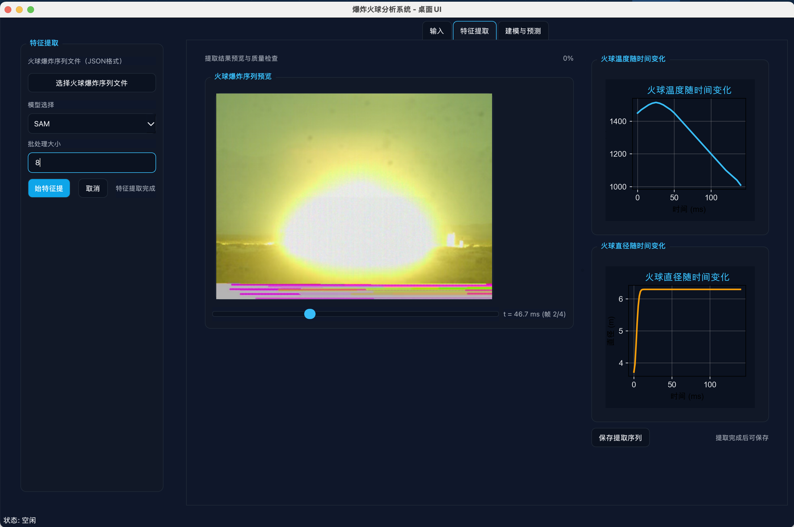
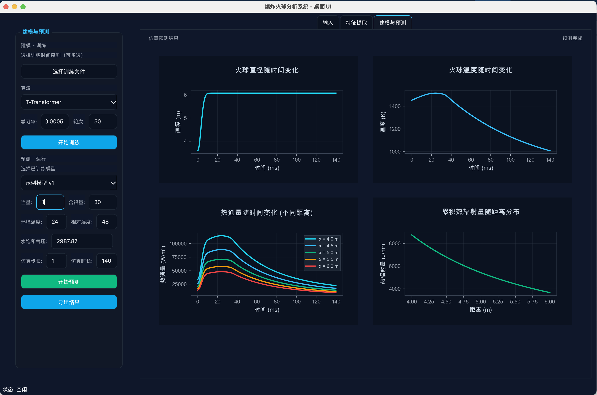

# 爆炸火球分析系统 (Fireball Analysis System)

一个基于Python的爆炸火球分析桌面应用程序，用于计算和分析爆炸火球的物理特性，包括半径变化、温度变化、大气传输率和热辐射等。

## 🚀 项目概述

本项目是一个专业的爆炸火球分析工具，集成了多种物理模型和计算方法，为爆炸研究、安全评估和工程应用提供科学计算支持。

## 🖼️ 界面预览

### 输入模块

*输入模块界面 - 支持图像序列导入、参数设置和实时预览*

### 特征提取模块

*特征提取模块界面 - 自动火球分割和特征分析*

### 建模与预测模块

*建模与预测模块界面 - 多物理场耦合计算和结果可视化*

### 主要特性

- **多物理场耦合计算**：火球半径、温度、大气传输、热辐射
- **可视化分析**：实时图表显示和结果导出
- **模块化设计**：清晰的代码结构和可扩展架构
- **专业界面**：基于PySide6的现代化桌面应用
- **数据导出**：支持CSV格式的详细数据导出

## 📁 项目结构

```
fireball_calculator/
├── README.md                           # 项目说明文档
├── document/                           # 文档目录
│   ├── fireball_radius_process.md      # 火球半径计算说明
│   ├── fireball_temperature_process.md # 火球温度计算说明
│   ├── transmissivity.md               # 大气传输率计算说明
│   ├── fireball_heat_radiation.md      # 热辐射计算说明
│   └── fireball_report.html            # 综合分析报告
├── images/                             # 图像资源
│   ├── UI/                             # 界面截图
│   │   ├── 输入.png                    # 输入模块界面
│   │   ├── 特征提取.png                # 特征提取模块界面
│   │   └── 建模与仿真.png              # 建模与预测模块界面
│   ├── fireball_sequence/              # 火球图像序列
│   ├── powder_content.png              # 粉末含量图
│   ├── radius_fitting_k2.png           # 半径拟合参数图
│   └── radius_parameters.png           # 半径参数图
├── papers/                             # 参考文献
│   ├── fireballexpansion.pdf           # 火球膨胀论文
│   ├── TNT和温压炸药的爆炸火球表面温度对比试验研究.pdf
│   └── 指数拖拽模型文章.pdf
├── source/                             # 源代码目录
│   ├── requirements.txt                # 项目依赖
│   ├── setup.sh                        # 环境设置脚本
│   ├── README.md                       # 源代码说明
│   ├── fireball_radius_calculator.py   # 火球半径计算器
│   ├── fireball_temperature_calculator.py # 火球温度计算器
│   ├── transmissivity_calculator.py    # 大气传输率计算器
│   ├── fireball_heat_radiation_calculator.py # 热辐射计算器
│   ├── generate_report.py              # 报告生成器
│   ├── desktop/                        # 桌面应用
│   │   ├── app.py                      # 应用入口
│   │   ├── framework.py                # 应用框架
│   │   ├── input_tab.py                # 输入模块
│   │   ├── extract_tab.py              # 特征提取模块
│   │   ├── model_tab.py                # 建模与预测模块
│   │   └── export_tab.py               # 导出模块
│   └── experiment/                     # 实验代码
│       ├── fireball_segmentation.py    # 火球分割算法
│       └── test_single_image.py        # 单图像测试
└── temp.csv                            # 温度数据示例
```

## 🧮 核心计算模块

### 1. 火球半径计算器 (`fireball_radius_calculator.py`)

**功能**：计算不同材料的火球半径随时间变化

**数学模型**：
```
R(t) = K × (1 - B×exp(-C×t²))
```
其中：
- `B = 0.41`（固定参数）
- `C = 0.05`（固定参数）
- `K`：根据材料类型选择（Table 3中的K2参数）

**支持材料**：
- Polyurethane（聚氨酯）
- 30%Al/Rubber（30%铝粉/橡胶）
- 40%Al/Rubber（40%铝粉/橡胶）
- 50%Al/Rubber（50%铝粉/橡胶）
- 60%Al/Rubber（60%铝粉/橡胶）

**输出**：火球半径、直径、膨胀速率随时间变化

### 2. 火球温度计算器 (`fireball_temperature_calculator.py`)

**功能**：计算火球表面温度随时间变化

**数学模型**：
- **上升段**（0 ≤ t ≤ t₀）：三次多项式
  ```
  T_up(t) = p₃×t³ + p₂×t² + p₁×t + p₀
  ```
- **衰减段**（t ≥ t₀）：拖曳衰减函数
  ```
  T_drag(t) = A + (T₀ - A) × exp(-k×(t - t₀))
  ```
- **过渡**：C1平滑过渡或严格连续拼接

**特点**：
- 温度单位：开尔文(K)
- 时间单位：毫秒(ms)
- 支持两种过渡模式：blend（平滑）和c1（严格连续）

### 3. 大气传输率计算器 (`transmissivity_calculator.py`)

**功能**：计算大气对热辐射的传输率

**数学模型**：
```
τ = f(log₁₀(X_H₂O), log₁₀(X_CO₂))
```

**默认参数**：
- 环境温度：24°C (297.15K)
- 相对湿度：48%
- 水饱和气压：2987.87Pa

**输出**：传输率随距离变化

### 4. 热辐射计算器 (`fireball_heat_radiation_calculator.py`)

**功能**：计算热通量和累积热辐射

**数学模型**：
- **热通量**：
  ```
  q(x,t) = E(t) × F(x,t) × τ(x)
  ```
  其中：
  - `E(t) = ε×σ×T(t)⁴`（辐射强度）
  - `F(x,t) = 1/4 × (D(t)/x)²`（几何视角系数）
  - `τ(x)`：大气传输率

- **累积热辐射**：
  ```
  H(x) = ∫₀ᵗˢ q(x,t) dt
  ```

**物理常数**：
- 火球表面比辐射率：ε = 0.9
- 斯蒂芬-波尔茨曼常数：σ = 5.67×10⁻⁸ W/(m²·K⁴)

## 🖥️ 桌面应用模块

### 应用架构

基于PySide6构建的现代化桌面应用，采用MVVM架构模式：

- **Model**：纯数据模型，无UI依赖
- **ViewModel**：业务逻辑和状态管理
- **View**：UI界面和用户交互

### 主要模块

#### 1. 输入模块 (`input_tab.py`)

**功能**：
- 导入火球图像序列或视频文件
- 导入火球温度时间序列数据
- 设置爆炸参数（当量、含铝量、环境参数）
- 实时预览火球图像序列
- 保存采样序列为JSON格式

**界面组件**：
- **左侧预览区域**：
  - 火球图像预览（支持时间轴拖动）
  - 爆炸温度变化图表
  - 时间轴控制滑块
- **右侧参数区域**：
  - 材料与环境参数显示（只读）
  - 保存采样序列按钮
- **侧边栏控制**：
  - 文件输入组：图像序列、视频、温度数据导入
  - 参数设置组：炸药类别、当量、含铝量设置

#### 2. 特征提取模块 (`extract_tab.py`)

**功能**：
- 加载火球爆炸序列文件
- 显示火球图像序列预览
- 自动计算火球直径随时间变化
- 显示温度变化曲线
- 保存提取结果

**界面组件**：
- **左侧预览区域**：
  - 火球图像序列预览
  - 时间轴控制滑块
- **右侧图表区域**：
  - 火球温度随时间变化曲线
  - 火球直径随时间变化曲线
- **侧边栏控制**：
  - 序列文件加载
  - 特征提取参数设置
  - 开始特征提取按钮

**技术特点**：
- 集成传统CV算法进行火球分割
- 支持深度学习模型（U-Net、SAM）
- 像素到物理单位的自动校准

#### 3. 建模与预测模块 (`model_tab.py`)

**功能**：
- 基于输入参数进行火球行为预测
- 生成四种预测曲线：
  - 火球直径随时间变化
  - 火球温度随时间变化
  - 热通量随时间变化（不同距离）
  - 累积热辐射量随距离分布
- 导出预测结果为CSV文件

**界面组件**：
- **主显示区域**：
  - 四个预测图表网格布局
  - 深色主题图表显示
  - 实时数据更新
- **侧边栏控制**：
  - 预测参数设置（当量、含铝量、仿真参数）
  - 环境参数设置（温度、湿度、气压）
  - 开始预测按钮
  - 导出结果按钮

**预测参数**：
- 爆炸当量（kg TNT）
- 含铝量（%）
- 仿真步长（ms）
- 仿真时长（ms）
- 环境温度（°C）
- 相对湿度（%）
- 水饱和气压（Pa）

#### 4. 应用框架 (`framework.py`)

**功能**：
- 主窗口管理
- 标签页切换
- 侧边栏管理
- 深色主题应用
- 通用组件定义

**核心组件**：
- `MatplotlibWidget`：自定义图表组件
- `ImagePreviewWidget`：图像预览组件
- `SidebarWidget`：侧边栏组件

## 🛠️ 安装和使用

### 环境要求

- Python 3.9+
- PySide6 6.5.0+
- NumPy 1.21.0+
- Matplotlib 3.5.0+
- OpenCV 4.5.0+（可选，用于图像处理）
- Pandas 1.3.0+（可选，用于数据处理）

### 安装步骤

1. **克隆项目**：
   ```bash
   git clone https://github.com/baihao/fireballCalculator.git
   cd fireballCalculator
   ```

2. **安装依赖**：
   ```bash
   cd source
   pip install -r requirements.txt
   ```

3. **运行应用**：
   ```bash
   cd desktop
   python app.py
   ```

### 快速开始

#### 步骤1：数据输入
1. 启动应用程序：`python app.py`
2. 在"输入"标签页：
   - 点击"导入火球图像序列"选择图像文件夹
   - 点击"导入火球温度时间序列"选择CSV文件
   - 在侧边栏设置爆炸参数（当量、含铝量等）
   - 点击"保存采样序列"保存配置

#### 步骤2：特征提取
1. 切换到"特征提取"标签页
2. 点击"选择火球爆炸序列文件"加载JSON文件
3. 查看火球图像序列预览和温度曲线
4. 点击"开始特征提取"进行自动分析
5. 查看生成的直径变化曲线

#### 步骤3：建模预测
1. 切换到"建模与预测"标签页
2. 在侧边栏设置预测参数：
   - 当量（kg TNT）
   - 含铝量（%）
   - 仿真步长和时长
   - 环境参数（温度、湿度、气压）
3. 点击"开始预测"生成四种预测曲线
4. 点击"导出结果"保存CSV文件

#### 界面操作提示
- **时间轴控制**：拖动滑块查看不同时刻的火球图像
- **参数同步**：左侧输入参数会自动同步到右侧显示
- **图表交互**：支持缩放、平移等交互操作
- **深色主题**：所有界面采用深色主题，适合长时间使用

## 📊 输出结果

### 图表输出

- **火球直径变化图**：显示直径随时间的变化趋势
- **火球温度变化图**：显示温度随时间的变化趋势
- **热通量变化图**：显示不同距离下的热通量变化
- **热辐射分布图**：显示累积热辐射随距离的分布

### 数据导出

CSV文件包含以下数据：
- 预测参数（当量、含铝量、材料类型等）
- 时间序列数据（时间、直径、温度）
- 热通量数据（不同距离的热通量变化）
- 累积热辐射数据（距离-热辐射关系）
- 环境参数（温度、湿度、物理常数等）

## 🔬 实验模块

### 图像分割算法

位于 `source/experiment/` 目录：

- **传统CV算法**：基于颜色和亮度阈值分割
- **深度学习算法**：U-Net、SAM等先进模型
- **测试脚本**：单图像和批量处理测试

### 算法特点

- **鲁棒性**：适应不同光照和背景条件
- **精度**：亚像素级别的轮廓检测
- **效率**：优化的计算流程
- **可扩展**：模块化设计，易于集成新算法

## 📚 技术文档

### 计算原理

详细的数学推导和物理原理请参考：
- `document/fireball_radius_process.md`
- `document/fireball_temperature_process.md`
- `document/transmissivity.md`
- `document/fireball_heat_radiation.md`

### 综合分析报告

`document/fireball_report.html` 包含：
- 完整的计算流程说明
- 仿真结果图表
- 参数敏感性分析
- 工程应用建议

## 🤝 贡献指南

欢迎贡献代码、报告问题或提出改进建议：

1. Fork 项目
2. 创建特性分支
3. 提交更改
4. 推送到分支
5. 创建 Pull Request

## 📄 许可证

本项目采用 MIT 许可证，详见 LICENSE 文件。

## 📞 联系方式

- 项目维护者：baihao
- 项目地址：https://github.com/baihao/fireballCalculator
- 问题反馈：请使用 GitHub Issues

## 🙏 致谢

感谢以下开源项目和研究工作：
- PySide6：跨平台GUI框架
- Matplotlib：科学绘图库
- NumPy：数值计算库
- 相关学术论文和研究机构

---

**注意**：本系统仅用于科研和工程分析，请确保在合法合规的范围内使用。
