# 火球计算系统 - 项目说明

## 系统介绍

火球计算系统通过对火球爆炸实验数据进行分析，提取火球爆炸过程相对于炸药参数的重要特征，实现对特定炸药参数下火球爆炸过程的仿真与相关计算。

### 系统演示

<video width="100%" controls>
  <source src="desktop/resources/fireball_demo.mp4" type="video/mp4">
  您的浏览器不支持视频播放。
</video>

## 软件功能与模块

火球计算系统主要分为三大模块：

1. **输入模块**：负责火球爆炸的图像和温度序列的输入
2. **特征提取模块**：从输入数据中提取火球特征
3. **建模与预测模块**：基于提取的特征进行建模和预测

---

## 输入模块

输入模块负责火球爆炸图像序列和温度序列的导入与参数配置，主要工作流程如下：

### 1. 导入火球图像序列

选择包含火球图像序列的文件夹进行导入。文件夹中的图像文件名需按照时间序列顺序排列，以确保系统能够正确识别和处理图像序列。

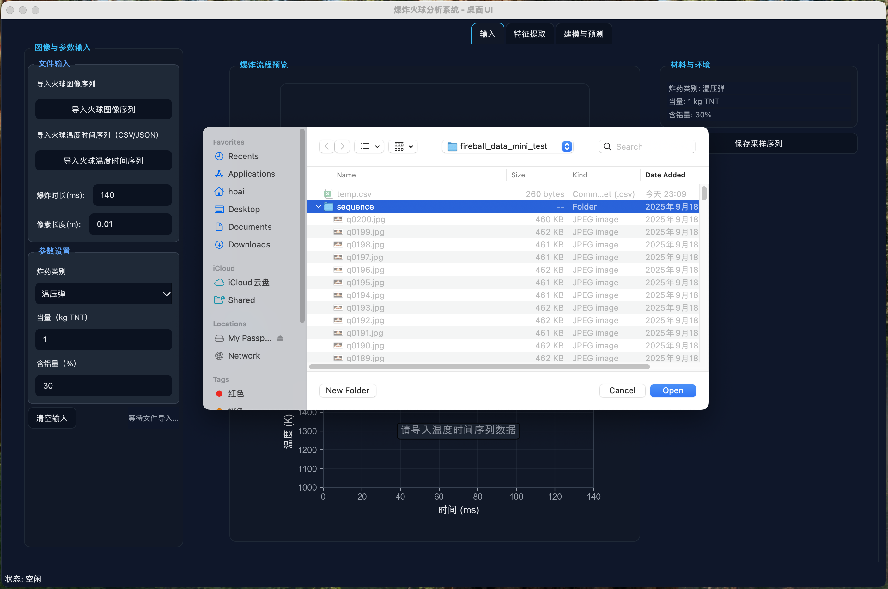

### 2. 火球图像序列显示与参数配置

导入完成后，用户可通过拖动时间轴查看整个火球爆炸过程。同时，需要配置以下关键参数：

- **爆炸时长**：火球爆炸的总时长（单位：毫秒）
- **像素长度**：图像单个像素点所代表的火球实际长度（单位：米）
- **炸药参数**：包括炸药类别、当量（kg TNT）、含铝量（%）等

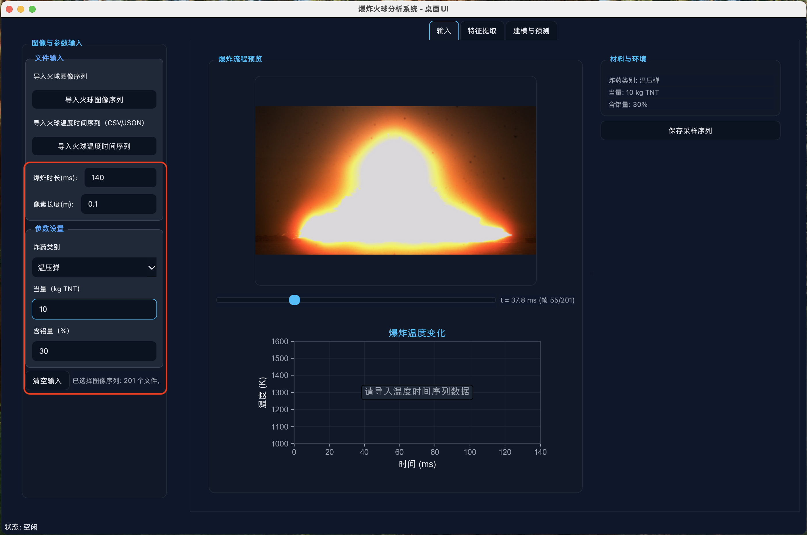

### 3. 导入火球温度序列

导入火球爆炸过程的温度时间序列数据。温度序列采用 CSV 格式，文件需包含两列数据：时间（Time_ms）和温度（Temperature_K）。

**温度序列数据格式示例（temp.csv）：**

| Time_ms | Temperature_K |
|---------|---------------|
| 0       | 1450          |
| 5       | 1470          |
| 10      | 1485          |
| 15      | 1500          |
| 20      | 1510          |
| 25      | 1515          |
| 30      | 1510          |
| 35      | 1500          |
| 40      | 1485          |
| 45      | 1470          |
| 50      | 1450          |
| 55      | 1425          |
| 60      | 1400          |
| 65      | 1375          |
| 70      | 1350          |
| 75      | 1325          |
| 80      | 1300          |
| 85      | 1275          |
| 90      | 1250          |
| 95      | 1225          |
| 100     | 1200          |
| 105     | 1175          |
| 110     | 1150          |
| 115     | 1125          |
| 120     | 1100          |
| 125     | 1080          |
| 130     | 1060          |
| 135     | 1040          |
| 140     | 1010          |

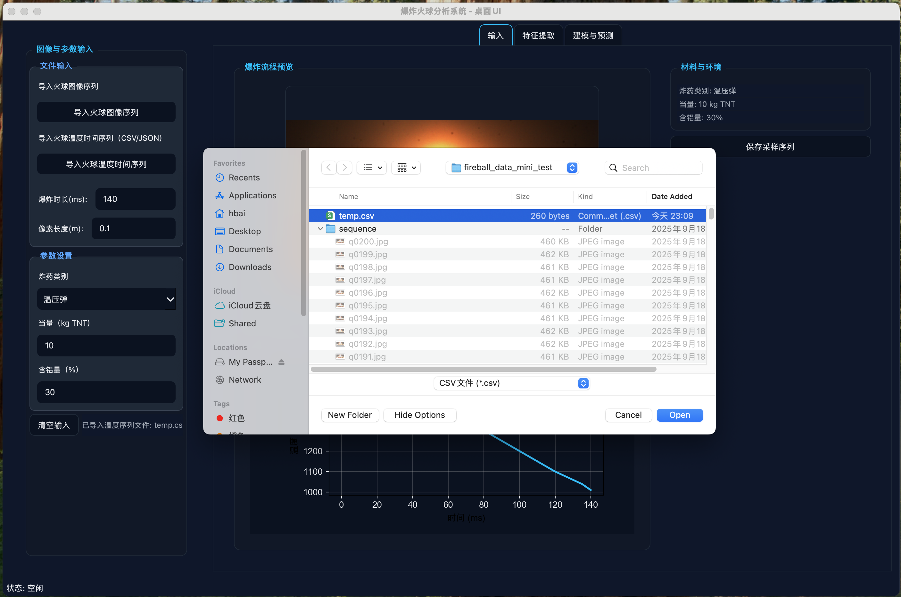

### 4. 保存火球爆炸序列

完成图像序列、温度序列导入和炸药参数配置后，可将所有数据导出为火球序列文件。导出的 JSON 文件包含：

- 火球图像序列路径信息
- 温度时间序列数据
- 炸药参数配置

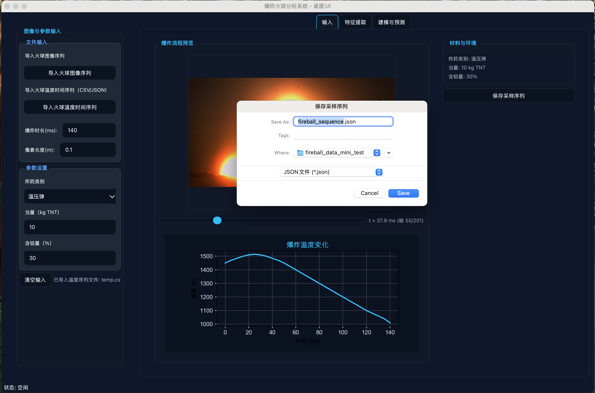

---

## 特征提取模块

特征提取模块基于导入的爆炸序列，对图像序列进行火球识别与分割，计算火球直径随时间的变化规律和最大直径值。通过去除噪声并对数据进行拖曳函数拟合，生成可用于建模与预测的曲线数据。

### 1. 导入火球爆炸序列

导入在输入模块中生成的火球爆炸序列文件（JSON 格式）。该文件包含火球图像序列、温度序列以及炸药参数等完整信息。

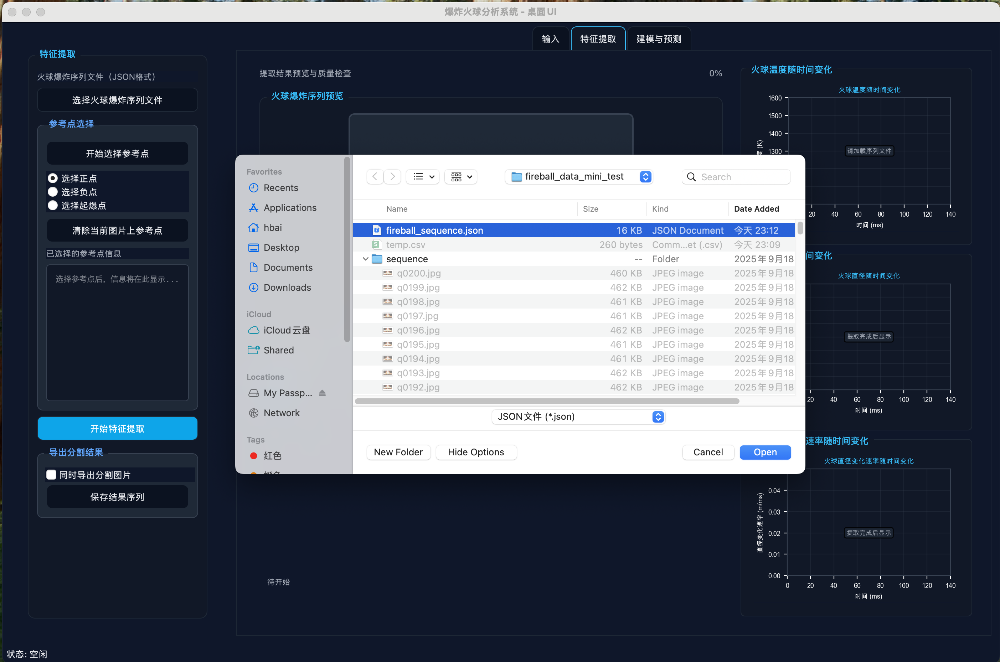

### 2. 选择参考点

点击"参考点选择"按钮进入参考点选择模式。系统提供三种参考点类型：

- **选择正点**：在火球内部区域选择若干个点，用于标识火球区域
- **选择负点**：在背景区域选择若干个点，用于区分背景与火球
- **选择起爆点**：选择火球爆炸的中心点，作为火球半径计算的起始点

**注意事项**：图片下方的时间轴被分为多个区间，需要在每个区间至少选择一张图片进行正负点标注，以确保分割算法在不同时间段的准确性。标注完成后，左侧的参考点信息面板会显示所有已选择参考点的详细坐标和统计信息。

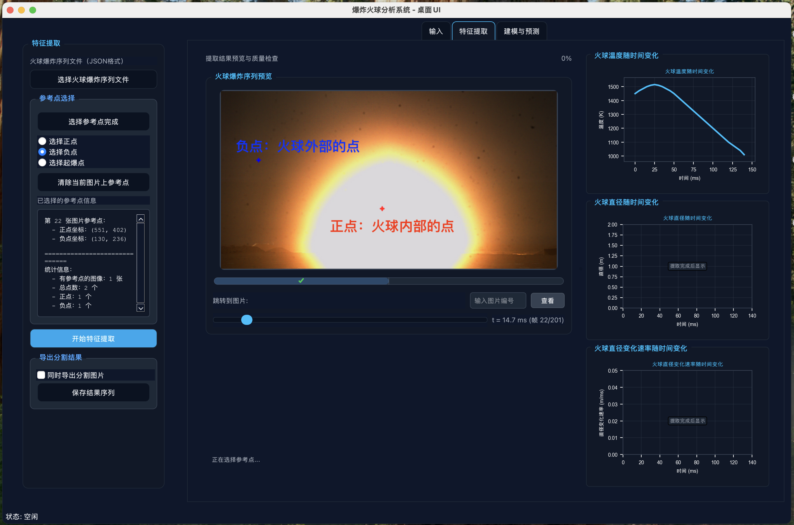

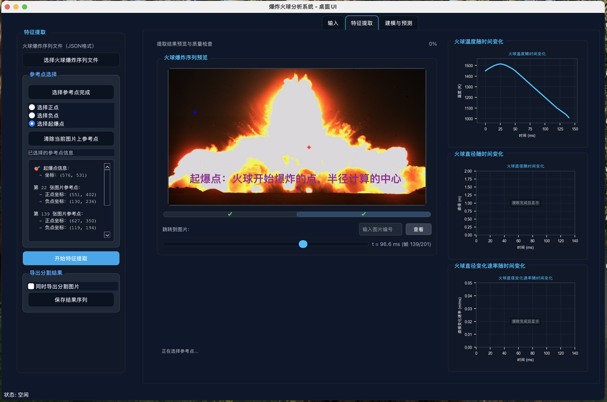

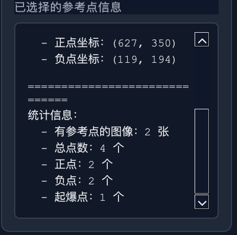

### 3. 执行特征提取

完成参考点选择后，点击"选择参考点完成"按钮退出选择模式，然后点击"开始特征提取"按钮启动特征提取流程。系统将基于爆炸图像序列和已选择的参考点进行火球分割与特征计算。提取过程的详细信息会实时显示在界面下方的信息栏中，包括当前处理的图片编号、使用的参考点数量等。

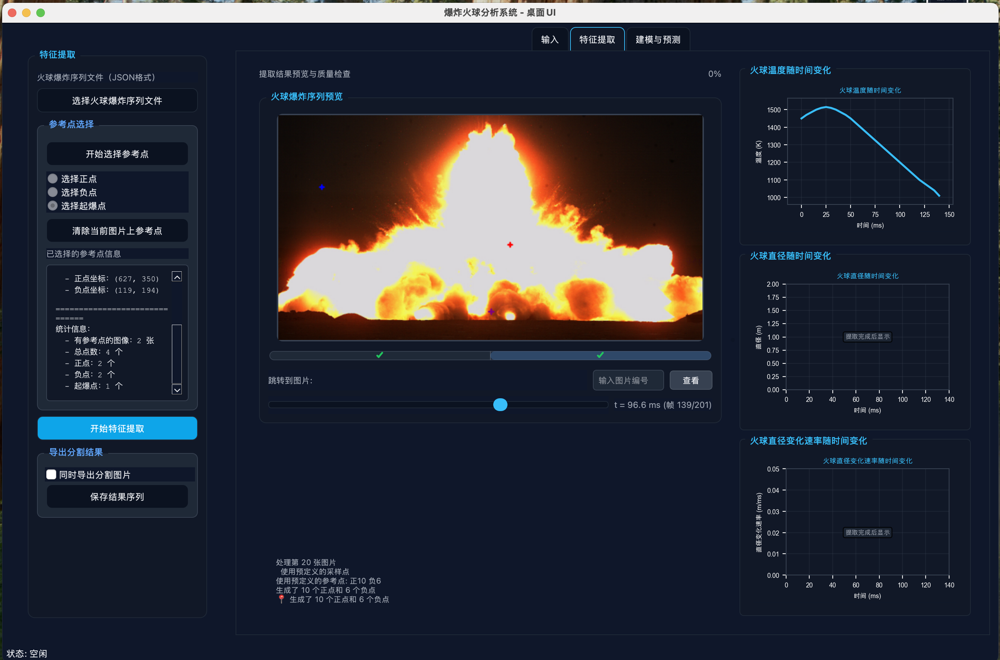

### 4. 查看分割结果

特征提取完成后，用户可通过拖动时间轴查看每一帧图像的分割结果，包括火球边界轮廓、质心位置和计算得到的最大半径。系统会根据分割结果自动计算火球直径随时间的变化，并在右侧面板生成以下可视化图表：

- **火球直径随时间变化**：显示火球直径在整个爆炸过程中的变化趋势
- **火球直径变化速率随时间变化**：显示火球膨胀速率的变化情况

系统会对原始直径数据进行去噪处理，并使用拖曳函数模型进行拟合，生成平滑的拟合曲线，为后续建模与预测提供高质量数据。

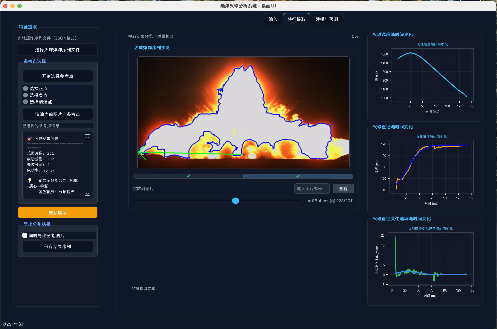

### 5. 保存分割结果

用户可将分割得到的火球直径数据及拟合结果保存为 JSON 文件。若勾选"同时导出分割图片"选项，系统会额外保存所有图像的分割结果图片，每张图片包含火球边界轮廓和最大半径标注。保存的分割图片可在文件系统中直接查看，便于后续分析和验证。

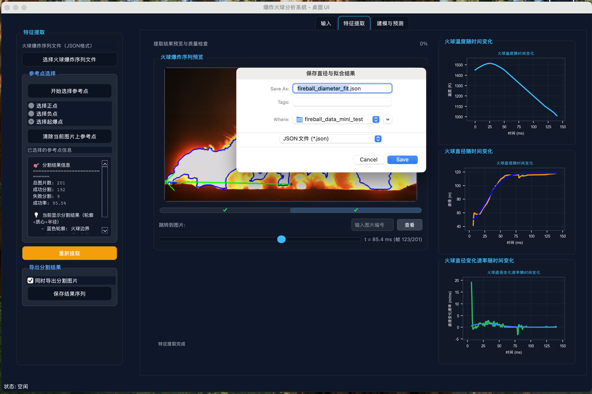

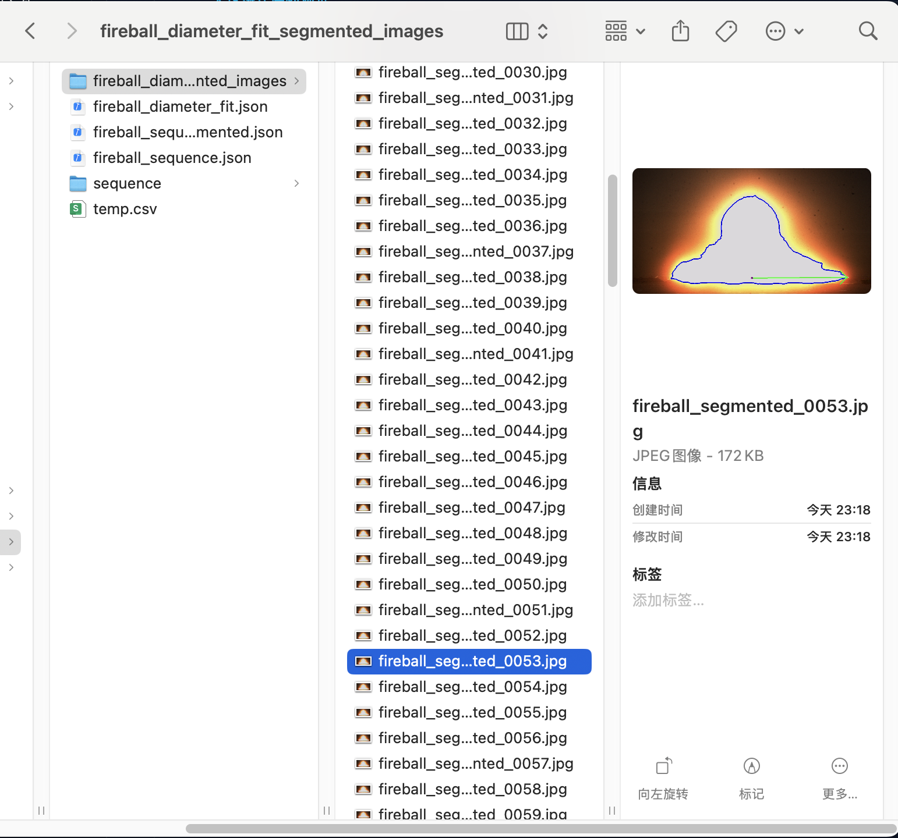

---

## 建模与预测模块

建模与预测模块以特征提取阶段得到的炸药参数、火球温度序列与直径序列为输入，训练人工智能模型，用于在给定炸药参数时快速预测火球温度、尺寸及其热辐射行为。

### 1. 导入训练文件

从特征提取模块导出的 JSON/CSV 即可作为训练数据。每组数据均包含炸药当量、含铝量、火球直径及温度曲线。为提升模型鲁棒性，建议一次导入 ≥10 组样本。

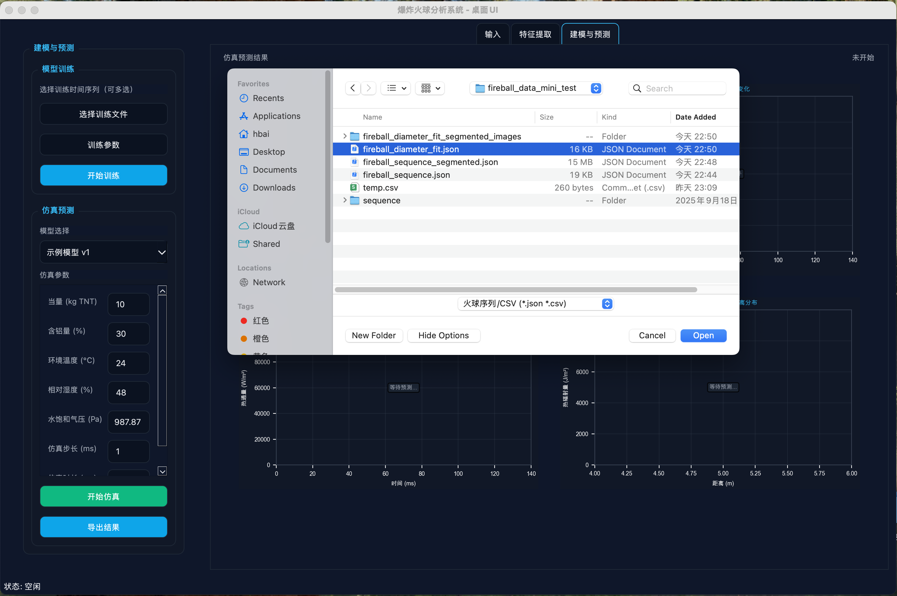

### 2. 配置训练参数

“训练参数”按钮用于设置算法、学习率、轮次等训练超参。当前版本暂未开放实际训练流程，参数面板会在后续版本中接入本地或云端训练任务。

### 3. 选择模型并运行仿真

完成训练后，选择目标模型并调节待预测的炸药参数，即可生成火球直径/温度随时间的预测曲线，并同步输出热通量与累积热辐射的空间分布。

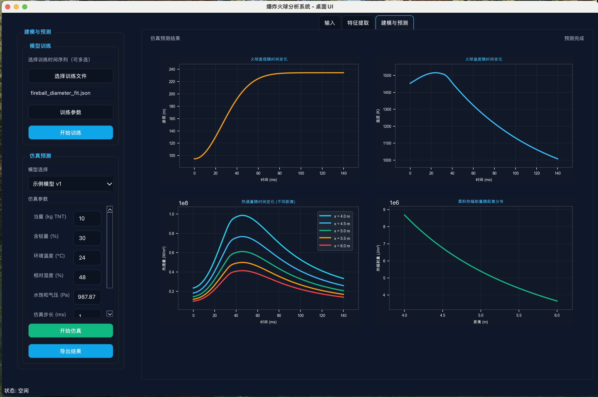

### 4. 导出仿真结果

仿真完成后，可将预测曲线与热辐射计算结果导出为 CSV（示例：`desktop/resources/fireball_prediction_20251117_225348.csv`）。文件包含参数摘要、时间序列、热通量曲线与累积热辐射等信息。部分示例数据如下：

预测参数（节选）：

| 参数名称   | 数值 | 单位    |
|-----------|------|---------|
| 爆炸当量   | 10.0 | kg TNT  |
| 含铝量     | 30.0 | %       |
| 仿真时长   | 140.0| ms      |
| 材料类型   | 30%Al/Rubber |  |

时间序列（节选）：

| 时间(ms) | 时间(s) | 火球直径(m) | 火球温度(K) |
|----------|---------|-------------|-------------|
| 0.0      | 0.000000| 94.61       | 1453.15     |
| 10.0     | 0.010000| 104.61      | 1489.85     |
| 50.0     | 0.050000| 212.59      | 1385.50     |
| 90.0     | 0.090000| 234.12      | 1171.74     |
| 140.0    | 0.140000| 234.46      | 1007.95     |

热通量示例（节选）：

| 时间(ms) | x=4.0m (W/m²) | x=5.0m (W/m²) | x=6.0m (W/m²) |
|----------|---------------|---------------|---------------|
| 0.0      | 2.34e7        | 1.45e7        | 9.84e6        |
| 20.0     | 5.24e7        | 3.26e7        | 2.20e7        |
| 60.0     | 9.09e7        | 5.64e7        | 3.82e7        |
| 100.0    | 5.28e7        | 3.28e7        | 2.22e7        |
| 140.0    | 3.33e7        | 2.07e7        | 1.40e7        |

累积热辐射量示例（节选）：

| 距离(m) | 热辐射量(J/m²) |
|---------|----------------|
| 4.00    | 8.68e6         |
| 4.53    | 6.56e6         |
| 5.10    | 4.38e6         |
| 5.63    | 4.18e6         |
| 6.00    | 3.65e6         |

### 热通量与热辐射公式

`fireball_heat_radiation_calculator.py` 基于辐射传热理论计算热通量 \(q(x,t)\) 与累积热辐射量 \(H(x)\)：

- 热通量：

  \[
  q(x,t) = \varepsilon \sigma T(t)^4 \cdot \frac{1}{4}\left(\frac{D(t)}{x}\right)^2 \cdot \tau(x)
  \]

  其中 \(\varepsilon\) 为火球表面比辐射率，\(\sigma\) 为斯蒂芬-波尔兹曼常数，\(T(t)\) 与 \(D(t)\) 分别为预测得到的温度与直径序列，\(\tau(x)\) 为距离 \(x\) 的大气透过率。

- 累积热辐射量：

  \[
  H(x) = \int_{0}^{t_{\max}} q(x,t)\,\mathrm{d}t
  \]

实现示例如下：

```44:66:source/fireball_heat_radiation_calculator.py
def compute_heat_flux_over_time(...):
    E_t = EPSILON * SIGMA * T_K**4
    F_t = 0.25 * (D_m / x_m)**2
    tau_x = transmissivity(x_m, trans_params)
    q_t = E_t * F_t * tau_x

def integrate_heat_radiation(q_t, t_ms):
    t_s = t_ms / 1000.0
    H = float(np.trapz(q_t, t_s))
    return H
```

---

## 快速开始

请阅读统一文档：`source/QUICK_START.md` 获取环境构建与运行步骤。

## 主要文件

- `source/environment.yml`：环境与依赖清单
- `source/setup.sh`：环境创建/复用脚本
- `source/desktop/app.py`：桌面应用入口
- `source/test_calculations.py`：计算公式验证脚本
- `source/fireball_radius_calculator.py`：计算模块

## 功能特性

- 支持多种非爆轰材料的火球直径/半径/膨胀速率计算
- 生成分析图表，支持中文显示
