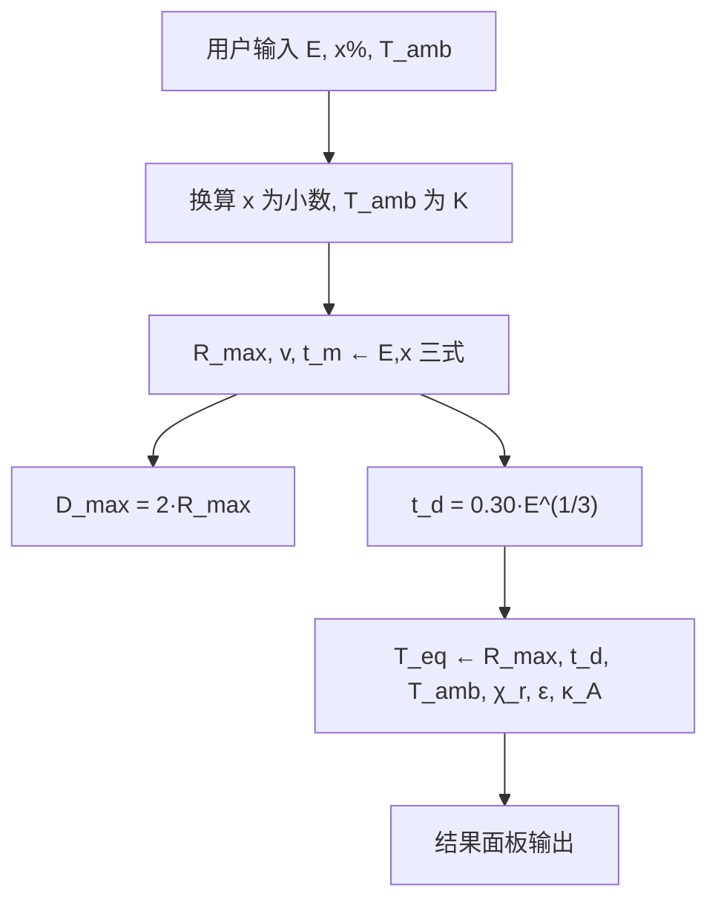

# 工程计算模块

桌面应用 **「工程计算」** 标签页：在已知 TNT 当量、含铝率与环境温度时，按给定资料中的闭式公式估算火球几何、时间尺度、膨胀速度与火球温度。**不**使用参数预测 Tab 中的拖曳曲线 K/B/C、核岭回归或 `FireballCalculator` 等其它经验路径。

## 目录结构

| 路径 | 说明 |
|------|------|
| `engineering_tab.py` | Tab 控件：读 UI、校验输入、调用计算、展示结果 |
| `ui_widgets/engineering_tab_ui.py` | **左侧全局侧栏**：输入参数、计算参数、「开始计算」；**主区**：仅结果文本 |
| `utils/image_formula_engineering.py` | 纯公式实现（无 Qt 依赖，可单测） |

入口：`FireballAnalysisApp` 在 `framework.py` 中注册第 4 个标签 **「工程计算」**。布局与「参数预测」等 Tab 一致：参数在左栏，主区域只显示输出。

结果 HTML 由 `format_engineering_result()` 生成：**一、公式**（集中罗列）→ **二、代入参数** → **三、按式计算**（每式一行代入与结果）。

---

## 计算流程总览



**执行顺序（与代码 `compute_engineering_estimate` 一致）：**

1. 解析并校验输入  
2. 计算 \(R_{\max}\)、\(v\)、\(t_m\)（含铝演化三式）  
3. 由 \(R_{\max}\) 得 \(D_{\max}\)  
4. 计算或覆盖 \(t_d\)（火球总持续时间）  
5. 计算 \(T_{\mathrm{eq}}\)（辐射能量平衡）  
6. 格式化文本写入结果面板  

---

## 输入量

### 必填（主界面）

| 符号 | UI 字段 | 单位 | 进入公式时的处理 |
|------|---------|------|------------------|
| \(E\)（\(W\)） | TNT 当量 | kg TNT | 直接使用，\(E>0\) |
| \(x\) | 含铝率 | %（界面） | `x = 含铝% / 100`，如 30 → 0.30 |
| \(T_{\mathrm{amb}}\) | 环境温度 | °C（界面） | `T_amb_K = T_amb_°C + 273.15` |

含铝项中统一使用 **\(x - 0.3073\)**，其中 **0.3073** 为资料给定的参考含铝率（小数，约 30.73%）。

### 计算参数（侧栏「计算参数」）

| 符号 | 默认值 | 含义 |
|------|--------|------|
| \(\chi_r\) | 0.4 | 爆炸总能量中转为热辐射的比例 |
| \(\varepsilon\) | 0.43 | 火球有效发射率 |
| \(\kappa_A\) | 0.8888 | 平均表面积 / 最大表面积（HSE 动态火球建议值） |
| \(\sigma\) | \(5.6704\times10^{-8}\) | Stefan–Boltzmann 常数 (W·m⁻²·K⁻⁴) |

火球总持续时间 **\(t_d\)** 仅由公式 \(t_d \approx 0.30\,E^{1/3}\) **计算输出**，不是侧栏输入。

### 代码内固定常数

| 常数 | 取值 |
|------|------|
| \(H_{\mathrm{TNT}}\) | \(4.184\times10^{6}\ \mathrm{J/kg}\) |

---

## 公式与输出量

### 步骤 1：含铝演化（\(E,\,x\)）

\[
R_{\max} = 2.1405\, E^{0.371}\, \exp\bigl[0.552\,(x - 0.3073)\bigr]
\quad (\mathrm{m})
\]

\[
v = 196.72\, E^{-0.089}\, \exp\bigl[-1.78\,(x - 0.3073)\bigr]
\quad (\mathrm{m/s})
\]

\[
t = 0.0057\, E^{0.426}\, \exp\bigl[0.630\,(x - 0.3073)\bigr]
\quad (\mathrm{s})
\]

**模块约定：**

- **最大膨胀速度** \(v_{\max} = v\)（上式直接给出，不再用 \(D/t\) 推算）  
- **达到最大尺寸时间** \(t_m = t\)  
- **最大直径** \(D_{\max} = 2 R_{\max}\)  

对应代码：`fireball_r_v_t_from_equivalent()`。

### 步骤 2：火球总持续时间

\[
t_d \approx 0.30\, W^{1/3}
\quad (\mathrm{s}),\quad W = E\ \ (\mathrm{kg\ TNT})
\]

对应代码：`fireball_total_duration_s()`。

### 步骤 3：温度特征时间（仅用于 \(T_{\mathrm{eq}}\)）

与展示用 \(t_d\) 分离，取较弱当量指数 \(\beta=0.2\)，使能量项随当量缓升：

\[
t_{\mathrm{char}} \approx 0.30\, W^{0.2}
\quad (\mathrm{s})
\]

对应代码：`fireball_temperature_char_time_s()`。

### 步骤 4：火球温度

在特征时间与球面上平均意义下的火球温度（公式符号仍记 \(T_{\mathrm{eq}}\)）：

\[
T_{\mathrm{eq}} =
\left[
T_{\mathrm{amb}}^{4}
+
\frac{\chi_r\, E\, H_{\mathrm{TNT}}}
{\varepsilon\, \sigma\, \kappa_A\, 4\pi R_{\max}^{2}\, t_{\mathrm{char}}}
\right]^{1/4}
\quad (\mathrm{K})
\]

- 使用步骤 1 的 \(R_{\max}\) 与步骤 3 的 \(t_{\mathrm{char}}\)（**不用** \(t_d\)）。  
- **\(T_{\mathrm{eq}}\)** 在界面与结果中称为 **火球温度**（原资料中的平均等效辐射温度记号仍保留为 \(T_{\mathrm{eq}}\)）。  
- 仿真时长仍用步骤 2 的 \(t_d\)。

对应代码：`equivalent_radiation_temperature_k()`。

---

## 输出摘要（结果面板）

| 输出 | 符号 | 单位 |
|------|------|------|
| 最大半径 | \(R_{\max}\) | m |
| 最大直径 | \(D_{\max}\) | m |
| 最大膨胀速度 | \(v_{\max}\) | m/s |
| 达最大尺寸时间 | \(t_m\) | s（同时显示 ms） |
| 火球总持续时间 | \(t_d\) | s（同时显示 ms） |
| 火球温度 | \(T_{\mathrm{eq}}\) | K 与 °C |

---

## 代码调用示例

```python
from engineering_tab.utils.image_formula_engineering import (
    EngineeringEstimateInputs,
    compute_engineering_estimate,
    parse_al_fraction,
)

inputs = EngineeringEstimateInputs(
    equivalent_kg=2000.0,
    al_fraction=parse_al_fraction(30.0),
    t_amb_k=24.0 + 273.15,
)
result = compute_engineering_estimate(inputs)
print(result.d_max_m, result.v_max_m_s, result.t_m_s, result.t_d_s, result.t_eq_k)
```

---

## 与「参数预测」Tab 的区别

| 项目 | 工程计算 | 参数预测 |
|------|----------|----------|
| 输入 | \(E,\,x,\,T_{\mathrm{amb}}\)（+ 少量辐射预设） | 当量/含铝或 K,B,C + 仿真时长等 |
| 方法 | 给定资料闭式公式 | 模型/拖曳曲线 + 温度 CSV 等 |
| 输出 | 标量估算量 | 时间序列与图表 |
| 依赖 | `image_formula_engineering.py` | `model_tab/utils/calculator.py` 等 |

---

## 校验与错误

- \(E \le 0\)：拒绝计算  
- 含铝率 \(< 0\)：拒绝计算  
- \(R_{\max},\, t_d,\,\varepsilon,\,\kappa_A \le 0\)：在 \(T_{\mathrm{eq}}\) 步骤报错  

界面层由 `engineering_tab.py` 捕获 `ValueError` 并弹窗提示。

---

## 文档与实现同步

公式以 `utils/image_formula_engineering.py` 文件头 docstring 为准；若资料修订系数，**仅改该文件**中的常数与函数即可，UI 文案通过 `format_engineering_result()` 自动跟随数值结果。
