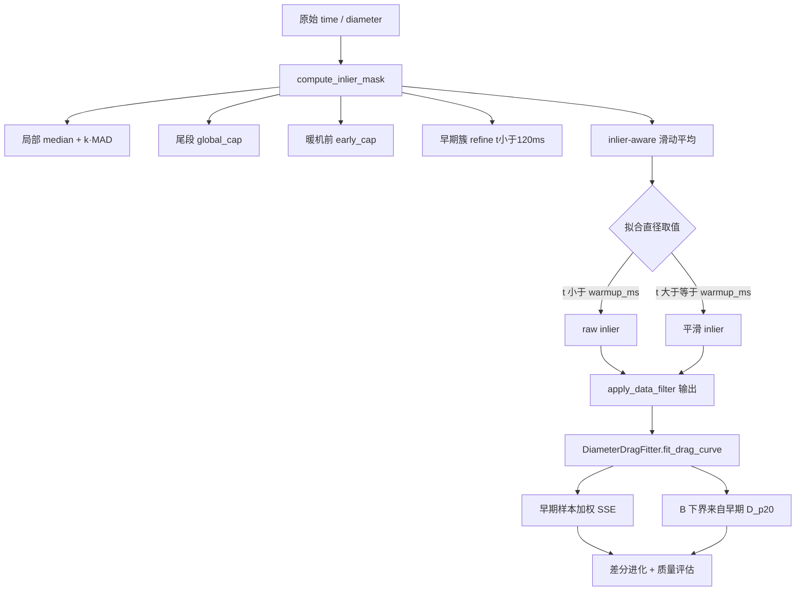

# 修复文档：离群点对火球初始直径（拖曳拟合）的影响

**适用模块**：`source/diameter_process`  
**典型复现数据**：`test_data/0925-1_fireball_sequence_1_30_segmented.json`  
**关联产物**：`*_segmented_drag_fit.png`  
**文档日期**：2026-09-10  

---

## 1. 问题现象

在序列 **0925-1** 上，分割直径在开头存在 **~70 m** 的 raw 尖峰，拖曳曲线拟合出现以下问题（修复前/修复中曾交替出现）：

| 表现 | 说明 |
|------|------|
| 截断过激 | 仅烟雾逻辑时，可能把有效早期数据几乎删光（保留率极低） |
| 拟合失控 | 过滤模块 import 失败时，**3232 点全量 raw** 拟合，R² 为负、K≈60 |
| **初始尺度偏高** | 过滤与 R² 改善后，蓝线在 **t→0** 仍约 **20 m**，而 inlier 主簇约 **8–12 m** |
| 残差图尖峰 | t≈0 附近残差可达 **+50 m**（尖峰未进拟合，但曲线起点仍被「早中段偏大点 + 优化目标」拉高） |

拖曳模型：

```text
D(t) = K · (1 − B · exp(−C · t²))
```

在 **t=0**：`D(0) = K·(1−B)`，即曲线截距由 **K 与 B 共同决定**。若优化几乎只拟合长平台段，**B 偏小** 会使 **D(0) 虚高**，即使开头尖峰已从 inlier 中剔除。

---

## 2. 根因分析

### 2.1 模块加载失败导致过滤未执行（严重 bug）

`data_filter.py` 中使用了 `Optional` 但未从 `typing` 导入，导入时触发 `NameError`。  
`diameter_drag_fitting.py` 对 `apply_data_filter` 做了 try/except，失败时 **`apply_data_filter = None`**，拟合路径会 **静默跳过数据过滤**，直接使用全序列 raw 数据。

### 2.2 滑动平均「窗口污染」

离群点在 `inlier_mask` 中已标记为 false，但拟合仍使用 **全序列滑动平均**：窗口内仍含 **70 m 尖峰**，导致例如 **t=17 ms** 的平滑直径被抬到 **~36 m**，进入拟合序列。

### 2.3 早期 inlier 仍含偏大分割误差

除 raw 尖峰外，**50–120 ms** 内仍有 **15–20 m** 左右的点通过 MAD 检验（相对尾段平台不算极端）。它们作为 inlier 参与拟合，在 **3000+ 平台点** 的 SSE 面前，主导 **B** 的估计，**D(0)** 被抬到 ~20 m。

### 2.4 优化目标未强调序列起点

全局优化（差分进化）使用 **未加权** 的平方和误差，早期点占比极小，**初始尺度与早段点**在目标函数中权重不足。

---

## 3. 修复方案总览



---

## 4. 代码改动清单

### 4.1 `data_filter.py`

| 项 | 说明 |
|----|------|
| **导入** | 增加 `from typing import ..., Optional` |
| **`_calculate_sliding_average_inlier_aware`** | 窗口内 **仅对 inlier** 求均值 |
| **`_early_phase_upper_bound`** | `t < warmup_ms` 时，直径不得高于后段膨胀初期的稳健上界 |
| **`_refine_early_inliers_by_cluster`** | 以暖机内 inlier 的 **p90×1.05** 为 cap，剔除 **t < 120 ms** 内明显偏高的点 |
| **`apply_data_filter`** | 拟合序列：`t < warmup_ms` 用 **raw**，否则用 **inlier-aware 平滑** |
| **常量** | `EARLY_CLUSTER_HORIZON_MS = 120.0`，`DEFAULT_WARMUP_MS = 50.0` 等 |

`compute_inlier_mask` 流程（顺序）：

1. 局部上界：`rolling_median + mad_k · MAD`  
2. 全局上界：暖机后尾段 `median + mad_k·MAD`，再乘 `TAIL_UPPER_MARGIN`（1.05）  
3. 暖机前附加 `early_cap`  
4. **`_refine_early_inliers_by_cluster`**

### 4.2 `diameter_drag_fitting.py`

| 项 | 说明 |
|----|------|
| **`_early_fit_weights(t)`** | `w = 1 + 4·exp(−Δt/200)`，抬高序列起点附近权重 |
| **`_B_lower_bound_from_early_diameter`** | 用过滤后 **前 80 ms 内 D 的 p20** 与 `max(D)` 估计 `B ≥ 1 − (D_p20/K_ref)·0.95`，并 **上限 clamp 为 0.66** |
| **`estimate_initial_parameters`** | 初始直径改用早期 **p20**，不再默认 `D[0]` |
| **`_improved_robust_fit` / `_standard_fit`** | 目标函数与 `curve_fit` 边界中应用 **加权残差** 与 **B 下界** |

### 4.3 `test_robust_data_filter.py`

- 新增 **`test_inlier_aware_smooth_not_contaminated_by_spike`**：验证尖峰剔除后邻域平滑不再被抬到 ~36 m。  
- 保留烟雾截断、早段尖峰不触发错误截断等用例。

### 4.4 绘图（既有逻辑，与修复一致）

- `drag_fit_plotter`：**绿点** = 参与拟合的 inlier；**红点** = 全 raw。  
- 拟合实际输入为 `apply_data_filter` 返回的 `(t, diameter)`，而非全 raw 平滑。

---

## 5. 0925-1 验证

### 5.1 命令

```bash
cd fireball_calculator/source/diameter_process

python3 -m unittest test_robust_data_filter -v

python3 fit_segmented_sequence.py \
  ../test_data/0925-1_fireball_sequence_1_30_segmented.json \
  ../test_data
```

### 5.2 修复后典型日志（参考）

```text
稳健离群剔除: 移除 250/3232 点 (... 暖机前上限 ~20.05m)
拟合用数据: 2982/3232 点（已剔除离群，无烟雾截断）
早期直径约束: D_p20≈11.97m → B ≥ 0.660
全局优化结果: K≈35.91, B≈0.66, C≈7.8e-06 量级
拟合质量: R²≈0.76, RMSE≈2.28 m
```

### 5.3 指标对比（定性）

| 阶段 | 离群剔除 | t≈17 ms 拟合直径 | D(0)=K(1−B) | R²（未加权评估） |
|------|----------|------------------|-------------|------------------|
| 过滤失败 + 全 raw | — | — | — | **≈ −8.4** |
| 仅 MAD + 全窗平滑 | ~187 | 曾被抬至 ~36 m | **~20 m** | ~0.90 |
| **当前修复** | **~250** | **~10 m（raw）** | **~12 m** | **~0.76** |

说明：**初始尺度与全序列 R² 存在权衡**。修复优先保证 **D(0) 与早期 inlier 簇一致**，不再被 70 m 尖峰或 50–120 ms 偏大点 + 平台段 SSE 拖高。

首段拟合点示例（修复后）：**t=17 ms, D≈9.98 m**（与主簇一致）。

---

## 6. 可调参数（二次调优）

| 参数 | 位置 | 作用 |
|------|------|------|
| `DEFAULT_WARMUP_MS` | `data_filter.py` | 暖机时间；raw/平滑分界 |
| `EARLY_CLUSTER_HORIZON_MS` | `data_filter.py` | 早期簇 refine 的时间范围（默认 120 ms） |
| `DEFAULT_MAD_K` | `data_filter.py` | 局部/尾段 MAD 倍数 |
| `emphasis_ms`（默认 200） | `_early_fit_weights` | 早期权重衰减时间常数 |
| `early_window_ms`（默认 80） | `_B_lower_bound_from_early_diameter` | 估计 D_p20 的窗口 |
| **B 下界上限 0.66** | `_B_lower_bound_from_early_diameter` | 增大 → D(0) 更低、R² 可能再降；减小 → D(0) 升高、R² 回升 |

建议调参顺序：**先调过滤（MAD / 早期簇 cap）→ 再调 B 下界上限 → 最后调早期权重**。

---

## 7. 回归与风险

- **其他序列**：强烟雾截断、短序列仍依赖 `_cutoff_passes_sanity`；单元测试覆盖「早段尖峰不错误截断」「平台后下降仍截断」。  
- **R² 下降**：对早段质量差、平台段很长的序列，加权 + B 约束可能使 **全局 R² 低于纯平台拟合**；需结合 **D(0) 与残差图** 判断。  
- **依赖 import 路径**：若新增语法/导入错误导致 `apply_data_filter` 为 `None`，会再次出现「全 raw 拟合」；发布前务必跑 `test_robust_data_filter` 与一条真实 JSON 拟合。

---

## 8. 相关文件索引

```text
source/diameter_process/
├── data_filter.py              # 离群剔除、烟雾截断、拟合用序列构造
├── diameter_drag_fitting.py    # 拖曳拟合、早期加权、B 下界
├── drag_fit_plotter.py         # 拟合图（inlier 绿点）
├── fit_segmented_sequence.py   # CLI：JSON → 拟合 → PNG
├── test_robust_data_filter.py  # 回归测试
└── docs/
    └── 修复文档_离群点与火球初始直径.md   # 本文档

test_data/
├── 0925-1_fireball_sequence_1_30_segmented.json
└── 0925-1_fireball_sequence_1_30_segmented_drag_fit.png
```

---

## 9. 结论

本次修复同时处理了 **数据管道 bug**（过滤未生效）、**平滑污染**、**早期分割离群 inlier** 以及 **优化目标对初始尺度不敏感** 四类问题。  
对 0925-1，**拟合曲线在起点的物理尺度**已与早期观测簇对齐（D(0) 由 ~20 m 降至 ~12 m 量级，首点 ~10 m），并保留可配置的 **R² ↔ 初始尺度** 权衡空间。
