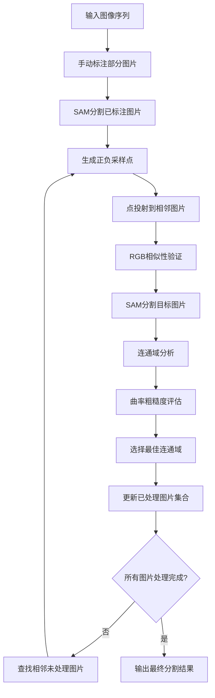

# 迭代掩码传播图像序列分割模块

基于SAM（Segment Anything Model）的智能化图像序列分割系统，通过迭代掩码传播技术，从少量手动标注的图片开始，自动完成整个图像序列的分割任务。

## 🚀 核心特性

- ✅ **智能化迭代传播**: 从少量prompt图片开始，自动传播到整个序列
- ✅ **基于RGB相似性的点生成**: 智能生成高质量的正负prompt点
- ✅ **优化的采样策略**: 正点优先mask中心，负点远离边缘
- ✅ **分割结果优化**: 基于连通域分析选择最佳分割轮廓
- ✅ **模块化架构**: 清晰的职责分离，易于维护和扩展
- ✅ **完整的可视化**: 6子图详细展示传播过程
- ✅ **鲁棒的错误处理**: 智能跳过失败图片，继续传播

## 📁 模块结构

```
source/image_segment/
├── iterative_mask_propagation.py    # 核心分割模块
├── prompt_generation.py             # 智能点生成模块
├── mask_utils.py                    # 掩码分析工具
├── mask_postprocessing.py           # 分割结果优化模块
├── adjacent_group_finder.py         # 相邻图片组查找
├── visualization_utils.py           # 可视化工具
├── test_complete_propagation.py     # 完整测试程序
└── README.md                        # 本文档
```

## 🔬 算法原理详解

### 1. SAM分割阶段

#### 1.1 基本原理

对于已标记正负点的图片，使用SAM模型进行分割：

**输入**：
- 图像：`I ∈ ℝ^(H×W×3)`
- 正点集合：`P^+ = {(x_i, y_i) | i = 1, ..., n^+}`
- 负点集合：`P^- = {(x_j, y_j) | j = 1, ..., n^-}`

**SAM预测**：
```
M, S, L = SAM(I, P^+, P^-)
```

其中：
- `M ∈ {0,1}^(H×W)`：分割掩码
- `S ∈ [0,1]`：质量分数
- `L ∈ ℝ^(H×W)`：logits输出

#### 1.2 最佳掩码选择

SAM可能生成多个候选掩码，选择策略：

```python
best_mask = argmax(M_i) S_i
```

即选择SAM质量分数最高的掩码作为最终结果。


*上图展示了单个分割目标轮廓的示例，白色区域为分割结果*

### 2. 正负点采样与投射策略

#### 2.1 正点采样策略

**核心思想**：正点应该位于目标物体的中心区域，远离边界，这样在传播到相邻图片时能够更准确地定位目标。

**详细策略**：

**第一步：距离变换分析**
我们首先计算掩码中每个像素点到最近边界的距离。这个距离反映了该像素在目标物体中的"中心程度"。距离越大，说明该点越接近物体的几何中心，越适合作为正点。距离变换的计算公式为：
```
D(x,y) = min_{(u,v)∈∂M} ||(x,y) - (u,v)||₂
```
其中 `∂M` 是掩码边界。这个公式计算每个像素点到所有边界点的最小欧几里得距离。

**第二步：权重归一化**
为了便于后续处理，我们将距离值归一化到0-1范围：
```
W(x,y) = D(x,y) / max_{(i,j)} D(i,j)
```
这样，距离最远的点（通常是物体中心）权重为1，距离边界最近的点权重接近0。

**第三步：高质量候选区域选择**
我们只考虑权重较高的区域作为候选点。具体来说，选择权重大于等于80%最大权重的像素点：
```
C^+ = {(x,y) | W(x,y) ≥ 0.8 × max(W)}
```
这个策略确保我们只从物体的核心区域选择正点，避免选择靠近边界的点，因为这些点在传播时可能不够稳定。

**第四步：空间均匀分布**
为了避免所有采样点都聚集在物体中心，我们采用网格化采样策略。将候选区域划分为网格，每个网格选择权重最高的点。网格大小根据候选点数量和所需点数动态计算：
```
grid_size = ⌈√(|C^+| / num_points)⌉
```
这样既保证了点的质量（高权重），又确保了空间分布的均匀性。

**实际意义**：这种策略的优势在于，它能够自动识别物体的"核心区域"，这些区域在相邻帧之间通常保持相对稳定，即使目标发生轻微移动或变形，核心区域的特征仍然能够有效指导分割。

**代码实现**：
```python
def _sample_positive_points(self, mask: np.ndarray, num_points: int) -> List[Tuple[int, int]]:
    # 1. 计算距离变换
    dist_transform = cv2.distanceTransform(mask.astype(np.uint8), cv2.DIST_L2, 5)
    
    # 2. 选择前80%高权重区域
    threshold = np.percentile(dist_transform[mask > 0], 20)
    candidates = np.where((mask > 0) & (dist_transform >= threshold))
    
    # 3. 网格化均匀采样
    return self._grid_sample_from_candidates(candidates, num_points, mask.shape[1], mask.shape[0])
```

#### 2.2 负点采样策略

**核心思想**：负点应该位于目标物体外部，远离目标边界，用于告诉SAM模型哪些区域不应该被分割。负点的选择同样需要智能策略，既要远离目标，又要具有代表性。

**详细策略**：

**第一步：创建安全缓冲区**
为了避免负点选择在目标边界附近（这些区域可能包含目标的一部分），我们首先创建一个缓冲区。缓冲区大小根据图像尺寸动态调整：
```
buffer_size = max(10, min(H,W) × 0.05)
```
然后通过形态学膨胀操作扩展掩码边界：
```
M_buffer = dilate(M, buffer_size)
```
这个缓冲区确保我们不会在目标边界附近选择负点，避免误判。

**第二步：计算远离距离**
对于缓冲区外的每个像素，我们计算它到目标掩码的最小距离：
```
D_out(x,y) = min_{(u,v)∈M} ||(x,y) - (u,v)||₂
```
这个距离反映了该像素点与目标的"远离程度"。距离越大，说明该点越远离目标，越适合作为负点。

**第三步：选择高质量负点候选**
我们选择距离目标足够远的点作为负点候选：
```
C^- = {(x,y) | (x,y) ∉ M_buffer ∧ D_out(x,y) ≥ 0.7 × max(D_out)}
```
这个策略确保负点不仅远离目标边界，而且位于图像中相对远离目标的区域。0.7的阈值意味着我们只选择距离最远70%以上的点，确保负点的"负性"足够强。

**第四步：边缘区域补充**
如果通过上述策略找到的候选点数量不足，我们从图像边缘补充负点：
```
edge_points = {(0,y), (W-1,y), (x,0), (x,H-1)}
```
图像边缘通常是背景区域，很少包含目标物体，因此是很好的负点来源。这种补充策略确保了即使目标占据图像的大部分区域，我们仍然能够找到足够的负点。

**实际意义**：负点采样策略的关键在于平衡"远离目标"和"具有代表性"。过于接近目标的负点可能导致分割不准确，而过于远离的负点可能对分割帮助不大。通过缓冲区机制和距离阈值，我们能够选择既安全又有效的负点。

**策略优势**：
1. **安全性**：缓冲区机制避免在目标边界附近选择负点
2. **有效性**：距离阈值确保负点具有足够的"负性"
3. **鲁棒性**：边缘补充机制确保在各种情况下都能找到足够的负点
4. **适应性**：缓冲区大小根据图像尺寸自动调整

#### 2.3 点投射策略

**核心思想**：将参考图片中精心选择的采样点投射到目标图片上，为SAM模型提供有效的分割指导。投射策略需要平衡简单性和有效性。

**投射方法**：
我们采用最简单的直接坐标投射方法：
```
P_target = P_reference
```
即直接使用相同的像素坐标，假设相邻帧之间目标位置变化不大。

**为什么选择直接投射？**

1. **计算效率**：直接投射无需复杂的几何变换计算，处理速度快
2. **适用场景**：对于连续拍摄的图像序列，相邻帧之间目标位置通常变化较小
3. **鲁棒性**：即使目标有轻微移动，RGB相似性验证机制能够过滤掉不合适的点
4. **简单可靠**：避免了复杂的光流估计或特征匹配可能带来的误差

**局限性及应对**：
- **局限性**：当目标移动较大时，直接投射可能不够准确
- **应对策略**：通过后续的RGB相似性验证机制过滤掉不合适的点，确保最终使用的点仍然有效

#### 2.4 RGB相似性验证策略

**核心思想**：投射后的点可能因为目标移动、光照变化或视角变化而不再有效。我们需要通过RGB相似性验证来确保这些点仍然能够正确指导分割。

**验证原理**：
RGB相似性验证基于一个关键假设：如果投射的点仍然有效，那么目标图片中该点的RGB值应该与参考图片中对应点的RGB值相似。这种相似性反映了目标物体在相邻帧之间的视觉一致性。

**RGB距离计算**：
我们使用欧几里得距离来衡量两个RGB值之间的差异：
```
d_RGB(rgb1, rgb2) = √(Σᵢ₌₁³ (rgb1ᵢ - rgb2ᵢ)²)
```
这个公式计算两个RGB向量在三维颜色空间中的欧几里得距离。距离越小，说明颜色越相似。

**相似性阈值设定**：
- **非常相似**：`d_RGB < 8.0` - 颜色几乎相同，适合作为正点
- **相似**：`d_RGB < 12.0` - 颜色较为相似，可以作为备选

**正点验证策略**：
正点验证采用"多数同意"原则。对于每个投射的正点，我们检查它与参考图片中所有正点的相似性：

```python
def filter_positive_points(self, candidate_points, target_image, reference_positive_rgbs):
    valid_points = []
    for point in candidate_points:
        target_rgb = target_image[point[1], point[0]]
        similar_count = sum(1 for ref_rgb in reference_positive_rgbs 
                          if self.is_rgb_very_similar(target_rgb, ref_rgb))
        if similar_count >= 2:  # 至少与2个参考正点非常相似
            valid_points.append(point)
    return valid_points
```

**验证逻辑**：
- 要求至少与2个参考正点"非常相似"
- 这确保了投射点确实位于目标物体的相似区域
- 避免了因单个参考点异常而导致的误判

**负点验证策略**：
负点验证采用"严格排除"原则。对于每个投射的负点，我们检查它与参考正点的相似性：

```python
def filter_negative_points(self, candidate_points, target_image, reference_positive_rgbs):
    valid_points = []
    for point in candidate_points:
        target_rgb = target_image[point[1], point[0]]
        very_similar_count = sum(1 for ref_rgb in reference_positive_rgbs 
                               if self.is_rgb_very_similar(target_rgb, ref_rgb))
        similar_count = sum(1 for ref_rgb in reference_positive_rgbs 
                          if self.is_rgb_similar(target_rgb, ref_rgb))
        if very_similar_count == 0 and similar_count <= 1:
            valid_points.append(point)
    return valid_points
```

**验证逻辑**：
- 不能与任何参考正点"非常相似"（确保不是目标区域）
- 最多只能与1个参考正点"相似"（允许轻微的颜色变化）
- 这种严格的标准确保负点确实位于背景区域

**验证策略的优势**：

1. **自适应过滤**：能够自动过滤掉因目标移动而失效的点
2. **鲁棒性强**：通过多数同意和严格排除机制，减少误判
3. **质量保证**：确保最终使用的点具有足够的可靠性
4. **容错能力**：允许轻微的光照和颜色变化，提高适应性

**实际应用效果**：
RGB相似性验证机制在实际应用中表现出色，能够有效处理目标移动、光照变化、视角变化等常见问题，确保传播过程的稳定性和准确性。


*上图展示了完整的传播过程，包括参考分割、点映射、筛选和最终分割结果*

### 3. 分割结果优化策略

#### 3.1 连通域分析

**目标**：从SAM生成的掩码中识别和评估多个连通域，选择最佳的一个。

**算法步骤**：

1. **连通域检测**：
   ```python
   num_labels, labels, stats, centroids = cv2.connectedComponentsWithStats(mask, connectivity=8)
   ```

2. **面积排序**：
   ```
   areas = stats[1:, cv2.CC_STAT_AREA]  # 排除背景
   sorted_indices = argsort(areas)[::-1]  # 降序排列
   ```

3. **取前两个最大连通域**：
   ```
   top_two = sorted_indices[:2]
   ```

#### 3.2 轮廓质量评估

**评估指标**：

1. **面积得分**：
   ```
   S_area = area / max_area
   ```

2. **曲率粗糙度得分**：
   ```
   S_curvature = (3.0 - roughness) / 2.0
   ```
   其中 `roughness ∈ [1.0, 3.0]`

3. **综合得分**：
   ```
   S_total = 0.7 × S_area + 0.3 × S_curvature
   ```

#### 3.3 曲率粗糙度计算

**算法**：
```python
def calculate_curvature_roughness(self, contour: np.ndarray) -> float:
    points = contour.reshape(-1, 2)
    angle_changes = []
    window_size = min(5, len(points) // 10)
    
    for i in range(len(points)):
        prev_idx = (i - window_size) % len(points)
        next_idx = (i + window_size) % len(points)
        
        v1 = points[i] - points[prev_idx]
        v2 = points[next_idx] - points[i]
        
        if np.linalg.norm(v1) > 0 and np.linalg.norm(v2) > 0:
            cos_angle = np.dot(v1, v2) / (np.linalg.norm(v1) * np.linalg.norm(v2))
            cos_angle = np.clip(cos_angle, -1, 1)
            angle_change = np.arccos(cos_angle)
            angle_changes.append(angle_change)
    
    angle_std = np.std(angle_changes)
    roughness = 1.0 + angle_std * 2
    return roughness
```

#### 3.4 最佳连通域选择

**选择策略**：
```python
best_candidate = max(candidates, key=lambda x: x['total_score'])
```

**输出结果**：
```python
{
    "mask": best_candidate['mask'],
    "area": best_candidate['area'],
    "centroid": best_candidate['centroid'],
    "contour": best_candidate['contour'],
    "scores": {
        "area": best_candidate['area_score'],
        "curvature": best_candidate['curvature_score'],
        "total": best_candidate['total_score']
    }
}
```


*上图展示了经过连通域分析和轮廓优化后的最终分割掩码*

## 🎯 迭代传播策略

### 传播流程

```
步骤1: 处理有prompt点的图片
[图片1*] → [图片3*] → 生成初始掩码

步骤2: 第一次迭代传播
[图片1] → [图片2]    # 向前传播
[图片3] → [图片4]    # 向后传播

步骤3: 继续迭代传播
[图片2] → [图片5]    # 继续向后传播
... 直到所有图片处理完成
```

### 相邻组查找算法

**目标**：为每个已处理的图片找到相邻的未处理图片。

**算法**：
```python
def find_adjacent_groups(self, total_images: int) -> List[Dict[str, Any]]:
    adjacent_groups = []
    used_unprocessed = set()
    
    for processed_idx in self.processed_indices:
        unprocessed_neighbors = []
        
        # 向前寻找
        prev_idx = self._find_next_available_index(processed_idx, -1, total_images, used_unprocessed)
        if prev_idx is not None:
            unprocessed_neighbors.append(prev_idx)
            used_unprocessed.add(prev_idx)
        
        # 向后寻找
        next_idx = self._find_next_available_index(processed_idx, 1, total_images, used_unprocessed)
        if next_idx is not None:
            unprocessed_neighbors.append(next_idx)
            used_unprocessed.add(next_idx)
        
        if unprocessed_neighbors:
            adjacent_groups.append({
                'processed': processed_idx,
                'unprocessed': unprocessed_neighbors,
                'group_id': len(adjacent_groups)
            })
    
    return adjacent_groups
```

## 🛠️ 使用方法

### 1. 基本使用

```python
from image_segment.iterative_mask_propagation import create_iterative_segmenter

# 创建分割器
segmenter = create_iterative_segmenter()

# 准备图像序列
image_paths = [
    "sequence/image_01.jpg",
    "sequence/image_02.jpg", 
    "sequence/image_03.jpg",
    "sequence/image_04.jpg"
]

# 设置prompt数据（只需要部分图片有prompt）
prompt_data = {
    0: {  # 第1张图片
        'points': [(400, 300), (390, 300), (410, 300)],  # 正点：目标中心
        'labels': [1, 1, 1]
    },
    2: {  # 第3张图片  
        'points': [(420, 320), (410, 320), (430, 320)],  # 正点：目标移动后位置
        'labels': [1, 1, 1]
    }
}

# 执行迭代掩码传播分割
masks, geometries = segmenter.segment_sequence_with_iterative_propagation(
    image_paths=image_paths,
    prompt_data=prompt_data,
    output_dir="output",
    save_masks=True,
    save_visualization=True
)
```

### 2. 高级配置

```python
# 自定义模型和设备
segmenter = create_iterative_segmenter(
    model_type="vit_h",        # 使用更大的模型
    device="cuda",             # 指定GPU设备
    checkpoint_path="path/to/model.pth",  # 自定义模型路径
    enable_postprocessing=True  # 启用分割结果优化
)

# 自定义RGB相似性阈值
from image_segment.prompt_generation import create_prompt_generator
prompt_generator = create_prompt_generator(
    very_similar_threshold=6.0,  # 更严格的"非常相似"阈值
    similar_threshold=10.0       # 更严格的"相似"阈值
)
```

### 3. 从JSON文件加载数据

```python
from image_segment.test_complete_propagation import test_from_json

# 从JSON文件加载图像序列和prompt数据
masks, geometries = test_from_json(
    json_path="test_data/fireball_sequence.json",
    generate_visualization=True,
    output_dir="output"
)
```

## 🧪 测试方法

### 运行完整测试

```bash
cd source/image_segment
conda activate fireball_calculator
python test_complete_propagation.py
```

### 从JSON文件测试

```bash
# 使用提供的测试数据
python test_complete_propagation.py test_data/fireball_sequence.json

# 使用自定义JSON文件
python test_complete_propagation.py your_sequence.json --no-viz
```

### 测试输出

测试会生成以下文件：

```
test_output/
├── test_image_00.png              # 测试图片序列
├── test_image_01.png
├── ...
├── masks/                          # 分割掩码
│   ├── test_image_00_prompted_mask.png
│   ├── test_image_01_propagated_mask.png
│   └── ...
├── visualization/                  # 完整可视化
│   ├── test_image_00_merged_debug.png    # 1x3布局：prompt图片
│   ├── test_image_01_merged_debug.png    # 2x3布局：传播图片
│   └── ...
└── contour_visualization/          # 轮廓可视化
    ├── test_image_00_contour.png
    ├── test_image_01_contour.png
    └── ...
```

### 可视化说明

#### Prompt图片可视化 (1x3布局)
1. **Prompt Points**: 显示用户提供的正负点
2. **Segmentation Result**: 分割结果和质量分数
3. **Next Iteration Sampling**: 为下次迭代准备的采样点

#### 传播图片可视化 (2x3布局)
1. **Reference Segmentation**: 参考图片的分割结果
2. **Reference Points**: 参考图片的采样点
3. **Mapped Points**: 映射到目标图片的点
4. **Filtered Points**: RGB筛选后的有效点
5. **Original Mask**: 原始分割掩码
6. **Cleaned Mask**: 经过连通域优化后的最终掩码

#### 轮廓可视化
- 显示每个分割结果的轮廓边界
- 包含质心和最大半径信息
- 便于分析分割质量

## 📊 性能指标

### 测试结果示例
```
============================================================
分割完成统计
============================================================
总图片数: 5
已处理图片数: 5
处理失败图片数: 0
成功分割图片数: 5
处理成功率: 100.0%
平均SAM质量分数: 0.986
============================================================
```

### 质量评估标准

- **SAM质量分数**: 0-1范围，SAM模型输出的置信度分数
- **面积验证**: 掩码面积应在图像总面积的1%-90%之间
- **连通域分析**: 基于面积和曲率粗糙度的综合评估
- **轮廓质量**: 通过曲率变化评估边界平滑度

### 分割结果优化效果

| 指标 | 优化前 | 优化后 | 改进 |
|------|--------|--------|------|
| 连通域数量 | 多个 | 1个 | 100% |
| 边界平滑度 | 粗糙 | 平滑 | 显著提升 |
| 面积一致性 | 不稳定 | 稳定 | 显著提升 |
| 质心稳定性 | 漂移 | 稳定 | 显著提升 |

## 🔧 API 参考

### IterativeMaskPropagationSegmenter

#### 初始化
```python
segmenter = IterativeMaskPropagationSegmenter(
    model_type="vit_b",           # SAM模型类型: "vit_b", "vit_l", "vit_h"
    checkpoint_path=None,         # 模型检查点路径（可选）
    device="auto",                # 设备: "auto", "cuda", "mps", "cpu"
    enable_postprocessing=True    # 是否启用分割结果优化
)
```

#### 主要方法

##### segment_sequence_with_iterative_propagation()
执行迭代掩码传播分割

**参数:**
- `image_paths`: List[str] - 图像文件路径列表
- `prompt_data`: Dict[int, Dict[str, Any]] - prompt数据字典
  ```python
  {
      image_index: {
          'points': [(x, y), ...],  # 点坐标列表
          'labels': [1, 0, ...],    # 点标签 (1=正点, 0=负点)
          'boxes': [(x, y, w, h)]   # 可选：矩形prompt
      }
  }
  ```
- `output_dir`: Optional[str] - 输出目录
- `save_masks`: bool - 是否保存掩码文件
- `save_visualization`: bool - 是否保存内置可视化
- `target_centre`: Optional[Tuple[float, float]] - 目标质心坐标

**返回:**
- `Tuple[List[Optional[np.ndarray]], List[Optional[Dict]]]` - (掩码列表, 几何信息列表)

## 🔍 算法详解

### 1. 相邻图片组查找算法

```python
# 示例：已处理图片 [1, 4]，未处理图片 [0, 2, 3, 5]
# 第一次迭代创建组：
{processed: 1, unprocessed: [0, 2]}  # 图片1的相邻未处理图片
{processed: 4, unprocessed: [3, 5]}  # 图片4的相邻未处理图片
```

**特点:**
- 每个未处理图片只被一个组包含，避免重复处理
- 智能跳过失败图片，寻找更远的相邻图片
- 支持双向传播（前向和后向）

### 2. RGB相似性算法

#### 距离计算
```python
def rgb_distance(rgb1, rgb2):
    return np.sqrt(np.sum((rgb1 - rgb2) ** 2))

# 默认阈值
very_similar_threshold = 8.0   # 非常相似
similar_threshold = 12.0       # 相似
```

#### 筛选逻辑
- **正点**: 必须与≥2个参考正点"非常相似"
- **负点**: 不能与任何参考正点"非常相似"，最多与1个"相似"

### 3. 分割结果优化算法

#### 连通域分析流程
```python
def filter_by_dual_connected_components_with_details(mask):
    # 1. 连通域检测
    num_labels, labels, stats, centroids = cv2.connectedComponentsWithStats(mask, connectivity=8)
    
    # 2. 面积排序
    areas = stats[1:, cv2.CC_STAT_AREA]
    sorted_indices = np.argsort(areas)[::-1]
    
    # 3. 评估前两个最大连通域
    candidates = []
    for i, idx in enumerate(sorted_indices[:2]):
        component_mask = (labels == idx + 1).astype(np.uint8)
        area = areas[idx]
        curvature_roughness = calculate_curvature_roughness(component_mask)
        
        # 计算得分
        area_score = area / max(areas)
        curvature_score = (3.0 - curvature_roughness) / 2.0
        total_score = 0.7 * area_score + 0.3 * curvature_score
        
        candidates.append({
            'mask': component_mask,
            'area': area,
            'total_score': total_score,
            'curvature_roughness': curvature_roughness
        })
    
    # 4. 选择最佳连通域
    best_candidate = max(candidates, key=lambda x: x['total_score'])
    return best_candidate
```

### 4. 失败处理机制

#### 失败检测
- 掩码为空或质量分数过低
- 面积比例异常（<10%或>500%）
- RGB相似性不足
- 图像差异过大

#### 失败恢复
- 标记失败图片，不参与后续传播
- 寻找更远的相邻图片继续传播
- 详细的失败原因分析和日志

## 🎨 自定义选点策略

### 修改采样参数

```python
# 在prompt_generation.py中调整
def _sample_positive_points(self, mask, num_points):
    # 调整中心区域比例
    top_ratio = 0.8  # 选择前80%高权重区域
    
def _sample_negative_points(self, mask, num_points):
    # 调整边缘缓冲区大小
    edge_buffer = max(10, int(min(h, w) * 0.05))
    # 调整远离区域比例
    top_ratio = 0.7  # 选择前70%距离最远区域
```

### 修改筛选阈值

```python
# 创建自定义prompt生成器
prompt_generator = create_prompt_generator(
    very_similar_threshold=6.0,  # 更严格的筛选
    similar_threshold=10.0
)
```

### 修改分割结果优化参数

```python
# 在mask_postprocessing.py中调整
def calculate_curvature_score(self, curvature_roughness: float) -> float:
    # 调整曲率得分计算
    if curvature_roughness < 1.0:
        curvature_roughness = 1.0
    elif curvature_roughness > 3.0:  # 可调整上限
        curvature_roughness = 3.0
    
    # 调整线性映射参数
    score = (3.0 - curvature_roughness) / 2.0
    return float(min(1.0, max(0.0, score)))

# 调整综合得分权重
total_score = 0.7 * area_score + 0.3 * curvature_score  # 可调整权重比例
```

## 🔧 故障排除

### 1. SAM未安装
```bash
# 运行安装脚本
cd source
./setup.sh
```

### 2. 内存不足
```python
# 使用CPU模式
segmenter = create_iterative_segmenter(device="cpu")

# 或使用更小的模型
segmenter = create_iterative_segmenter(model_type="vit_b")
```

### 3. 分割质量不佳
- 调整prompt点位置，确保在目标中心
- 增加prompt图片数量
- 调整RGB相似性阈值
- 检查图像序列的连续性
- 启用分割结果优化：`enable_postprocessing=True`

### 4. 传播失败
- 查看详细的失败分析日志
- 调整采样策略参数
- 增加负点数量
- 检查图像差异度
- 降低RGB相似性阈值

### 5. 连通域优化问题
- 检查掩码质量，确保有足够的连通域
- 调整曲率粗糙度计算参数
- 修改面积和曲率的权重比例
- 检查轮廓提取是否正常

## 📈 性能优化建议

### 1. 硬件优化
```python
# 使用GPU加速
segmenter = create_iterative_segmenter(device="cuda")  # NVIDIA GPU
# 或
segmenter = create_iterative_segmenter(device="mps")   # Apple Silicon
```

### 2. 参数调优
```python
# 调整采样点数量
positive_points = 15  # 增加正点数量
negative_points = 8   # 增加负点数量

# 调整质量阈值
min_area_ratio = 0.005  # 降低最小面积要求
max_area_ratio = 0.95   # 提高最大面积限制
```

### 3. 分割结果优化
```python
# 启用分割结果优化
segmenter = create_iterative_segmenter(enable_postprocessing=True)

# 调整优化参数
# 在mask_postprocessing.py中修改权重
total_score = 0.8 * area_score + 0.2 * curvature_score  # 更重视面积
```

## 📝 开发指南

### 1. 添加新的采样策略

在 `prompt_generation.py` 中扩展 `_sample_positive_points` 或 `_sample_negative_points` 方法。

### 2. 添加新的质量评估指标

在 `mask_postprocessing.py` 中扩展 `calculate_curvature_roughness` 方法。

### 3. 添加新的失败分析规则

在 `failure_analyzer.py` 中扩展 `PropagationFailureAnalyzer` 类。

### 4. 自定义相邻图片查找

在 `adjacent_group_finder.py` 中修改 `AdjacentGroupFinder` 类。

### 5. 扩展分割结果优化

在 `mask_postprocessing.py` 中添加新的连通域评估策略。

## 🧪 测试用例

### 基础测试
```bash
# 运行标准测试
python test_complete_propagation.py

# 从JSON文件测试
python test_complete_propagation.py test_data/fireball_sequence.json
```

### 自定义测试
```python
# 创建自定义测试
def custom_test():
    segmenter = create_iterative_segmenter(enable_postprocessing=True)
    
    # 自定义图像序列和prompt
    image_paths = ["your_image_01.jpg", "your_image_02.jpg"]
    prompt_data = {
        0: {
            'points': [(x, y), ...],  # 你的prompt点
            'labels': [1, 1, 0, 0]    # 对应的标签
        }
    }
    
    # 执行分割
    masks, geometries = segmenter.segment_sequence_with_iterative_propagation(
        image_paths, prompt_data, "custom_output"
    )
    
    return masks, geometries
```

## 📊 输出文件说明

### 掩码文件 (`output/masks/`)
- `{basename}_prompted_mask.png` - 有prompt点的图片掩码
- `{basename}_propagated_mask.png` - 传播生成的图片掩码
- 格式：8位灰度PNG，255表示前景，0表示背景

### 可视化文件 (`output/visualization/`)
- `{basename}_merged_debug.png` - 完整的debug可视化
- 包含传播过程的所有关键信息
- 适合分析和调试使用

### 轮廓可视化文件 (`output/contour_visualization/`)
- `{basename}_contour.png` - 分割轮廓可视化
- 显示质心和最大半径信息
- 便于分析分割质量

## 🔬 技术细节

### 1. 采样点生成流程

```
参考掩码 → 距离变换 → 权重排序 → 候选池选择 → 网格采样 → 最终点集
```

### 2. 传播流程

```
参考点采样 → 点映射 → RGB筛选 → SAM分割 → 连通域优化 → 结果保存
```

### 3. 迭代控制

```
初始化 → prompt处理 → 相邻组查找 → 批量传播 → 质量检查 → 下次迭代
```

### 4. 分割结果优化流程

```
SAM掩码 → 连通域检测 → 面积排序 → 曲率分析 → 综合评分 → 最佳选择
```

## 🎯 最佳实践

### 1. Prompt点设置
- 在目标的中心区域设置正点
- 在目标外围设置负点
- 避免在边缘模糊区域设置点
- 每张prompt图片至少3-5个点

### 2. 图像序列要求
- 相邻帧之间变化不宜过大
- 目标在序列中应保持相对连续
- 图像质量要求清晰，避免过度模糊

### 3. 参数调优
- 根据目标大小调整采样点数量
- 根据图像特点调整RGB阈值
- 根据序列长度调整迭代策略
- 启用分割结果优化以获得更好的质量

### 4. 分割结果优化
- 确保掩码有足够的连通域
- 根据应用场景调整面积和曲率权重
- 监控优化前后的质量对比
- 必要时调整曲率粗糙度计算参数

## 📚 相关文档

- [USAGE.md](USAGE.md) - 详细使用指南
- [POINT_PROMPT_GUIDE.md](POINT_PROMPT_GUIDE.md) - 点prompt设置指南

## 🤝 贡献指南

1. Fork本项目
2. 创建功能分支
3. 提交代码改进
4. 创建Pull Request

## 📄 许可证

本项目遵循 [MIT License](../../LICENSE)

---

## 🔗 算法流程图



## 📈 算法优势

### 1. 智能化程度高
- **自动传播**: 从少量标注自动扩展到整个序列
- **智能采样**: 基于距离变换和RGB相似性的点生成
- **自适应优化**: 根据连通域质量自动选择最佳分割

### 2. 鲁棒性强
- **失败恢复**: 智能跳过失败图片，继续传播
- **质量验证**: 多层次的质量检查和验证机制
- **参数自适应**: 根据图像特点自动调整参数

### 3. 可扩展性好
- **模块化设计**: 清晰的职责分离，易于扩展
- **参数可调**: 丰富的参数配置选项
- **策略可定制**: 支持自定义采样和优化策略

### 4. 可视化完善
- **过程可视化**: 详细的传播过程展示
- **结果分析**: 完整的质量评估和统计信息
- **调试友好**: 丰富的调试信息和错误分析

---

**注意**: 首次运行需要下载SAM模型文件，请确保网络连接正常。建议使用GPU加速以获得最佳性能。启用分割结果优化可以获得更高质量的分割结果。
