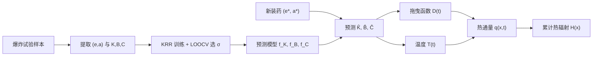

# 基于核岭回归的火球爆炸预测方法

## 摘要

含铝炸药火球爆炸过程涉及直径膨胀、温度演化与热辐射等多个物理量。本方法以**核岭回归**（Kernel Ridge Regression, KRR）为核心，在有限次爆炸试验或图像反演样本上，建立炸药**当量**与**含铝量**到火球直径拖曳参数 \(K,B,C\) 的非线性映射；预测得到 \(\hat K,\hat B,\hat C\) 后，仍由**拖曳函数**及热辐射工程模型生成直径、温度、热通量与累计热辐射等时间序列。本文档侧重阐述 KRR 的数学原理、方法选择的依据、超参数通过留一交叉验证（LOOCV）优化的机理，以及该方法在火球预测问题中的建模逻辑与适用边界。

---

## 1 火球预测问题的建模思路

### 1.1 物理过程与待预测量

火球直径随时间演化可用拖曳型经验函数描述：

\[
D(t) = K\,\bigl[1 - B\,\exp(-C\,t^2)\bigr],
\]

其中 \(t\) 为时间（ms），\(K\) 与火球最大直径渐近值相关，\(B\) 为初始状态常数，\(C\) 为时间尺度参数。对每组爆炸实验，可通过对实测直径序列进行非线性拟合得到一组 \((K_i,B_i,C_i)\)。

不同装药的当量 \(e\)（kg TNT）与含铝量 \(a\)（%）改变时，火球能量释放与铝粉燃烧行为发生变化，\(K,B,C\) 随之改变。因此，火球直径预测的核心子问题可表述为：

\[
(K,B,C) = f(e,\, a),
\]

给定新的 \((e_{\ast}, a_{\ast})\)，先估计 \(\hat K,\hat B,\hat C\)，再代入上式得到 \(D(t)\)，并进一步耦合温度模型与 Stefan–Boltzmann 热辐射计算，完成爆炸效应评估。

### 1.2 为何采用“机理函数 + 数据驱动中间参数”的混合建模

若直接用机器学习拟合 \(D(t)\) 全曲线，模型自由度极高，在样本稀少时极易过拟合，且难以保证曲线在物理上合理（如单调膨胀、正直径、有限渐近值等）。本方法采用**混合策略**：

1. **保留拖曳函数**作为直径演化的结构约束，保证预测曲线具有与实验标定一致的函数形态；
2. **仅用 KRR 学习**低维中间参数 \(K,B,C\) 对 \((e,a)\) 的依赖，降低学习难度；
3. 将“**物理机理**”与“**数据校正**”分离：机理由拖曳函数承担，数据校正由 KRR 承担。

这一思路在工程上称为**代理模型**（surrogate model）或**响应面**思想：在输入空间 \((e,a)\) 与输出参数 \((K,B,C)\) 之间建立可泛化的映射，再接入已有确定性仿真模块。

### 1.3 输入特征与输出目标

对第 \(i\) 组样本，构造二维输入：

\[
x_i =
\begin{bmatrix}
e_i \\
e_i \cdot (a_i/100)
\end{bmatrix}
=
\begin{bmatrix}
\text{当量 (kg TNT)} \\
\text{铝粉质量 (kg)}
\end{bmatrix}.
\]

第一维表征爆炸能量尺度；第二维在「当量即装药总质量」约定下，等价于配方中铝粉质量，从而同时编码含铝量信息。输出为三个**标量回归目标** \(K_i,B_i,C_i\)，分别建模为三个独立的 KRR 模型 \(f_K,f_B,f_C\)，共享输入 \(x\)，但各自拥有不同的核超参与回归系数。

---

## 2 方法选择：为何使用核岭回归

### 2.1 问题特征

含铝炸药火球试验数据通常具有以下特点：

| 特征 | 含义 | 对建模方法的要求 |
|------|------|------------------|
| **小样本** | 有效试验组数往往为数十组甚至更少 | 需要强正则、避免高维参数空间 |
| **非线性** | \(K,B,C\) 对当量、含铝的响应非线性、可能非单调 | 需要非线性回归能力 |
| **低维输入** | 仅 2 维特征 | 无需深度网络的大容量 |
| **连续输出** | \(K,B,C\) 为实数 | 回归而非分类 |
| **外推需求** | 需在训练范围附近插值预测新装药 | 希望解光滑、不过度振荡 |

### 2.2 与常见替代方法的比较

**（1）线性回归 / 多项式回归**

形式简单，可解释性强，但难以刻画含铝量与当量之间的复杂耦合；高阶多项式在小样本下易过拟合，外推行为不稳定。

**（2）普通核回归（无岭正则）**

核方法通过核函数隐式映射到高维特征空间，可拟合非线性关系。但在 \(n\) 很小时，核矩阵 \(K\) 可能接近奇异，解对噪声极度敏感，留一验证误差往往不稳定。

**（3）核岭回归（本方法）**

在核回归目标函数中加入 RKHS 范数惩罚 \(\lambda\|f\|_{\mathcal{H}}^2\)，等价于对系数施加 Tikhonov 正则，使 \(K+\lambda I\) 可逆、解更稳定。**小样本非线性回归**正是 KRR 的典型适用场景。

**（4）高斯过程回归（GPR）**

同样适合小样本，且可提供预测不确定性。但超参数（核长度尺度、噪声方差）推断计算量更大；多输出联合建模（\(K,B,C\) 相关）结构更复杂。本项目中 \(K,B,C\) 物理含义不同、对输入的响应尺度各异，采用**三个独立 KRR** 更直接，也便于对每个目标单独 LOOCV 选核宽度。

**（5）神经网络**

需要较多样本才能稳定训练；对 \(n<10\) 的爆炸试验数据，泛化风险高，且缺乏小样本下可解释的超参数选择流程。

**综合结论**：KRR 在**样本有限、输入低维、关系非线性、需要光滑插值**的条件下，是兼顾拟合能力、计算代价与稳定性的合理选择；与“拖曳函数 + 中间参数”的混合架构相匹配。

### 2.3 本方法的核心优势（归纳）

1. **非线性**：RBF 核将输入映射到无限维特征空间，可逼近复杂的 \(f(e,a)\)；
2. **正则化**：\(\lambda\) 控制函数平滑程度，抑制小样本过拟合；
3. **解析解**：系数 \(\alpha=(K+\lambda I)^{-1}y\) 可一次求解，无需迭代优化；
4. **物理可解释性**：最终直径仍由拖曳函数生成，\(K,B,C\) 具有明确物理含义；
5. **独立多目标**：\(f_K,f_B,f_C\) 分模型训练，允许各参数有不同的最优核尺度 \(\sigma^{\ast}\)。

---

## 3 核岭回归的理论基础

### 3.1 再生核希尔伯特空间（RKHS）视角

给定训练集 \(\mathcal{D}=\{(x_i,y_i)\}_{i=1}^{n}\)，\(x_i\in\mathbb{R}^{d}\)，\(y_i\in\mathbb{R}\)。设 \(\mathcal{H}\) 为由正定核 \(k(\cdot,\cdot)\) 诱导的 RKHS。核岭回归求解：

\[
\min_{f\in\mathcal{H}} \ \sum_{i=1}^{n}\bigl(y_i - f(x_i)\bigr)^2 + \lambda\,\|f\|_{\mathcal{H}}^{2},
\qquad \lambda>0.
\]

第一项为**经验风险**（拟合误差），第二项为**结构风险**（函数复杂度惩罚）。\(\lambda\) 越大，越倾向于光滑、变化缓慢的 \(f\)；\(\lambda\) 越小，越贴近训练点，但方差增大。

### 3.2 表示定理与闭式解

根据 RKHS 中的**表示定理**，上述优化问题的最优解必为训练点处核函数的线性组合：

\[
f(x) = \sum_{i=1}^{n}\alpha_i\, k(x_i,x).
\]

记核矩阵 \(K\in\mathbb{R}^{n\times n}\)，\(K_{ij}=k(x_i,x_j)\)，\(y=(y_1,\ldots,y_n)^{\mathsf T}\)，则最优系数满足：

\[
\alpha = (K + \lambda I)^{-1} y.
\]

对新输入 \(x_{\ast}\)，预测值为：

\[
\hat y = f(x_{\ast}) = \sum_{i=1}^{n}\alpha_i\, k(x_i,x_{\ast}).
\]

**直观理解**：预测是训练输出 \(y_i\) 的加权平均，权重由 \(x_{\ast}\) 与各训练点 \(x_i\) 的核相似度 \(k(x_i,x_{\ast})\) 及整体正则共同决定。与 \(x_{\ast}\) 越“接近”的训练样本，贡献越大。

### 3.3 与岭回归、核方法的关系

- 若 \(k(x,x^{\prime})=x^{\mathsf T}x^{\prime}\)（线性核），KRR 退化为**特征空间中的岭回归**；
- 若 \(\lambda\to 0\) 且 \(K\) 可逆，趋近于**插值型核回归**（精确过训练点）；
- 加入 \(\lambda I\) 后，即使 \(K\) 病态或 \(n\) 较小，\((K+\lambda I)\) 仍良态，这是 KRR 优于无正则核回归的关键。

### 3.4 高斯径向基（RBF）核

本项目采用各向同性高斯 RBF 核，长度尺度 \(\sigma>0\)：

\[
k_{\sigma}(x,x^{\prime}) = \exp\!\left(-\frac{\|x-x^{\prime}\|^{2}}{2\sigma^{2}}\right).
\]

**几何含义**：\(\sigma\) 控制“影响半径”。\(\sigma\) 小则核函数衰减快，模型仅利用邻近训练点，决策边界（响应面）局部变化剧烈，**方差大、偏差小**，易过拟合；\(\sigma\) 大则远距离样本仍有较大权重，响应面更平滑，**偏差大、方差小**，易欠拟合。

在二维输入 \((e,\, e\cdot a/100)\) 下，\(\sigma\) 同时影响对当量方向与含铝方向的平滑程度；因两目标量纲不同，核距离 \(\|x-x^{\prime}\|\)  implicitly 混合了两维贡献，故 \(\sigma\) 需由数据通过交叉验证确定，而非先验指定。

### 3.5 正则系数 \(\lambda\) 的作用

\(\lambda\) 与 \(\sigma\) 共同构成**偏差–方差权衡**：

- **\(\lambda\) 增大**：压缩 \(\|\alpha\|\)，降低模型对单个训练点的依赖，提高泛化稳定性；
- **\(\lambda\) 减小**：更灵活地拟合训练集，训练误差下降但测试风险上升。

本项目中 \(\lambda\) 取固定小正值（如 \(10^{-3}\)），主要依赖 LOOCV 优化 \(\sigma\)；在样本极少时，亦可对 \(\lambda\) 做网格搜索，但当前策略以单一 \(\lambda\) 简化超参空间，把自由度留给对非线性影响更直接的 \(\sigma\)。

### 3.6 三个独立 KRR 模型的理由

\(K,B,C\) 虽来自同一拖曳拟合，但：

- 数值量级与变化范围不同（如 \(K\) 为米级，\(C\) 为 ms\(^{-2}\) 量级）；
- 对当量、含铝的敏感度不同（比例系数与时间常数可能呈现不同非线性形态）；
- 拟合误差结构不同，最优平滑程度 \(\sigma^{\ast}\) 未必相同。

故对 \(y\in\{K,B,C\}\) **分别**训练 \(f_y\)，各自 LOOCV 选 \(\sigma_y^{\ast}\)，比强制共享一个核宽度或采用多输出联合模型更符合物理与统计上的独立性假设。

---

## 4 超参数优化：留一交叉验证（LOOCV）

### 4.1 需要优化哪些超参数

| 超参数 | 符号 | 是否 LOOCV 优化 | 说明 |
|--------|------|-----------------|------|
| RBF 长度尺度 | \(\sigma\) | **是** | 控制非线性程度与平滑度，对泛化影响最大 |
| 岭正则系数 | \(\lambda\) | 否（固定） | 取小正值，提供数值稳定与轻度平滑 |
| 核函数形式 | RBF | 否 | 低维连续回归的标准选择 |

### 4.2 LOOCV 的原理

在样本量 \(n\) 不大时，若随机划分训练/测试集（如 80%/20%），测试集仅含个别点，评估方差极大。**留一交叉验证**利用全部 \(n\) 个样本参与训练和验证：

对 \(i=1,\ldots,n\)：

1. 以 \(\mathcal{D}_{-i}=\mathcal{D}\setminus\{(x_i,y_i)\}\) 训练 KRR，得到 \(f_{-i,\sigma}\)；
2. 在留出样本上计算预测 \(\hat y_i=f_{-i,\sigma}(x_i)\)；
3. 累加平方误差 \((y_i-\hat y_i)^2\)。

对给定 \(\sigma\)，**LOOCV 测试均方误差**为：

\[
\mathrm{MSE}_{\mathrm{test}}(\sigma)
= \frac{1}{n}\sum_{i=1}^{n}\bigl(y_i - f_{-i,\sigma}(x_i)\bigr)^{2}.
\]

最终选取：

\[
\sigma^{\ast} = \operatorname*{arg\,min}_{\sigma\in\mathcal{G}} \mathrm{MSE}_{\mathrm{test}}(\sigma),
\]

其中 \(\mathcal{G}\) 为候选网格。对 \(K,B,C\) 三个目标**分别**执行上述过程，得到 \(\sigma_K^{\ast},\sigma_B^{\ast},\sigma_C^{\ast}\)。

### 4.3 为何采用 LOOCV

1. **几乎无浪费数据**：每次用 \(n-1\) 条训练，验证 1 条；\(n\) 次轮换后，每条样本都充当过一次“独立测试点”，适合 \(n\) 为个位数到几十的爆炸试验集。

2. **评估目标与部署一致**：最终模型用于预测“训练集未出现过的装药条件”；LOOCV 模拟的正是“未见过的样本点”，比在同一数据集上直接最小化训练误差更能反映泛化能力。

3. **确定性的模型选择**：对每个 \(\sigma\)，LOOCV 误差为确定值，无需多次随机划分；便于比较 \(\sigma\)–MSE 曲线、检查过拟合/欠拟合趋势。

4. **与 KRR 计算相容**：对岭回归，LOOCV 预测有基于影响函数的快速公式；即使采用显式留一实现，\(n\) 较小时计算仍可接受。

### 4.4 \(\sigma\) 候选网格的构造

候选 \(\sigma\) 在当量范围 \([e_{\min},e_{\max}]\) 上构造：令

\[
\mathrm{stride} = \frac{e_{\max}-e_{\min}}{30},
\qquad
\sigma_j = 1 + j\cdot\mathrm{stride},\quad j=0,1,\ldots,30.
\]

共 31 个候选。网格下界取 1，上界随试验当量跨度扩展，使 \(\sigma\) 与输入空间尺度相匹配；当量极差退化时，采用固定步长容错。对每个 \(\sigma_j\) 计算 \(\mathrm{MSE}_{\mathrm{train}}(\sigma_j)\) 与 \(\mathrm{MSE}_{\mathrm{test}}(\sigma_j)\)，可绘制**误差–带宽曲线**：训练误差随 \(\sigma\) 减小而下降、测试误差呈 U 型或 L 型时，最小测试误差点即 \(\sigma^{\ast}\)。

### 4.5 最终模型的拟合

LOOCV 仅用于**选择 \(\sigma^{\ast}\)**，不直接作为部署模型。选定 \(\sigma^{\ast}\) 后，在**全部 \(n\) 条样本**上以 \((\sigma^{\ast},\lambda)\) 重新训练 KRR，得到用于推理的 \(f_y(\cdot)\)。理由：

- LOOCV 模型 \(f_{-i}\) 各自少一条样本，仅用于评估；
- 部署时应充分利用全部数据，得到对训练域内装药的最优估计。

### 4.6 过拟合与欠拟合的诊断

| 现象 | \(\mathrm{MSE}_{\mathrm{train}}\) | \(\mathrm{MSE}_{\mathrm{test}}\) | 可能原因 |
|------|-----------------------------------|----------------------------------|----------|
| 过拟合 | 很低 | 明显高于 train | \(\sigma\) 过小，\(\lambda\) 过小 |
| 欠拟合 | 较高 | 与 train 接近且均高 | \(\sigma\) 过大，模型过于平坦 |
| 合理 | 适中 | 接近 train 且为 U 型谷底 | \(\sigma^{\ast}\) 附近 |

若 \(n<5\)，LOOCV 估计本身方差较大，\(\sigma^{\ast}\) 可能不稳定，应结合物理合理性（如 \(\hat K>0\)、\(\hat B\in(0,1)\) 等）与额外试验验证。

---

## 5 火球爆炸预测的完整应用流程

### 5.1 训练阶段

**数据来源**：由特征提取模块得到的爆炸序列 JSON，每条记录包含当量、含铝量，以及由直径时序拟合得到的 \((K,B,C)\)（拟合成功标志为真）。

**步骤概要**：

1. 由 \(n\) 条有效记录构造 \(X\in\mathbb{R}^{n\times 2}\) 与标签 \(y^{(K)},y^{(B)},y^{(C)}\)；
2. 对 \(y\in\{K,B,C\}\)，在 \(\mathcal{G}\) 上 LOOCV 选 \(\sigma_y^{\ast}\)；
3. 以 \(\sigma_y^{\ast}\) 与 \(\lambda\) 在全数据上训练 \(f_K,f_B,f_C\)；
4. 持久化模型与 LOOCV 诊断曲线，供后续预测与复核。

### 5.2 预测阶段

给定待评估装药 \((e_{\ast},a_{\ast})\)，构造

\[
x_{\ast} =
\begin{bmatrix}
e_{\ast} \\
e_{\ast} \cdot (a_{\ast}/100)
\end{bmatrix},
\]

分别预测：

\[
\hat K = f_K(x_{\ast}),\quad
\hat B = f_B(x_{\ast}),\quad
\hat C = f_C(x_{\ast}).
\]

### 5.3 由中间参数到爆炸过程量

**（1）火球直径**

\[
D(t) = \hat K\,\left[1 - \hat B\,\exp\bigl(-\hat C\,t^2\bigr)\right].
\]

**（2）温度**

若有实测温度序列则直接采用；否则采用参考温度剖面，并按当量对时间轴作 \((e/100)^{2/3}\) 量级缩放。

**（3）热通量与累计热辐射**

在 \(D(t)\)、\(T(t)\) 及环境参数已知条件下，由 Stefan–Boltzmann 定律、几何视角因子与大气透过率模型，计算距离 \(x\) 处 \(q(x,t)\) 及 \(H(x)=\int q\,\mathrm{d}t\)。

### 5.4 端到端逻辑

KRR 在整个链条中仅承担**装药参数 \(\to\) 拖曳系数**这一环；前后环节由物理模型与实验数据支撑，从而兼顾**数据效率**与**机理可信度**。

---

## 6 适用条件、局限与使用建议

### 6.1 适用条件

- 有效样本 \(n\ge 2\)（LOOCV 最低要求）；建议 \(n\ge 5\) 以获得较稳定的 \(\sigma^{\ast}\)；
- 输入 \((e,a)\) 与标签 \((K,B,C)\) 由统一流程提取，保证标签质量；
- 预测装药位于训练集**凸包附近**或适度内插，而非大幅外推。

### 6.2 主要局限

1. **外推风险**：KRR 为光滑插值型模型，超出训练当量/含铝范围时，\(\hat K,\hat B,\hat C\) 缺乏物理保证，需试验验证；
2. **标签误差传递**：\(K,B,C\) 来自直径拟合，拟合误差会进入 KRR 标签噪声；
3. **独立建模假设**：\(f_K,f_B,f_C\) 未显式利用三参数间的物理约束（如某些工况下的相关关系）；
4. **固定 \(\lambda\)**：未对 \(\lambda\) 交叉验证，在极小子样本下可能非最优。

### 6.3 使用建议

- 训练完成后检查 LOOCV 曲线，确认 \(\sigma^{\ast}\) 位于测试误差谷底而非边界；
- 对比 \(\hat K,\hat B,\hat C\) 在训练点上的留一预测与实测标签，评估各目标拟合质量；
- 对关键装药条件，优先补充试验点再扩大 KRR 训练集；
- 仿真结果与拖曳函数形态、最大直径量级等工程经验交叉核对。

---

## 7 符号说明

| 符号 | 含义 |
|------|------|
| \(e,a\) | 炸药当量 (kg TNT)、含铝量 (%) |
| \(x\) | 输入特征 \((e,\, e\cdot a/100)^{\mathsf T}\) |
| \(K,B,C\) | 拖曳函数参数 |
| \(D(t)\) | 火球直径 (m) |
| \(k(\cdot,\cdot)\) | 正定核函数（RBF） |
| \(\sigma\) | RBF 长度尺度 |
| \(\sigma^{\ast}\) | LOOCV 选定的最优长度尺度 |
| \(\lambda\) | 岭正则系数 |
| \(\alpha\) | KRR 对偶系数向量 |
| \(f_K,f_B,f_C\) | 三个标量 KRR 预测函数 |
| \(\mathrm{MSE}_{\mathrm{test}}(\sigma)\) | 留一交叉验证测试均方误差 |

---

## 参考文献与延伸阅读

- 核方法与 RKHS：Schölkopf & Smola, *Learning with Kernels*（表示定理、KRR 与正则化路径）；
- 模型选择与小样本：Hastie et al., *The Elements of Statistical Learning*（交叉验证、偏差–方差分解）；
- 火球直径拖曳模型与工程计算：项目文档 `document/fireball_radius_process.md`；
- 热辐射计算：项目文档 `document/fireball_heat_radiation.md`；
- 实现细节与接口约定：同目录 `KRR_KBC_METHOD.md`（供开发与集成参考）。

---

*文档定位：面向方法说明与学术/report 写作；实现与 CLI 细节见 `KRR_KBC_METHOD.md`。*
